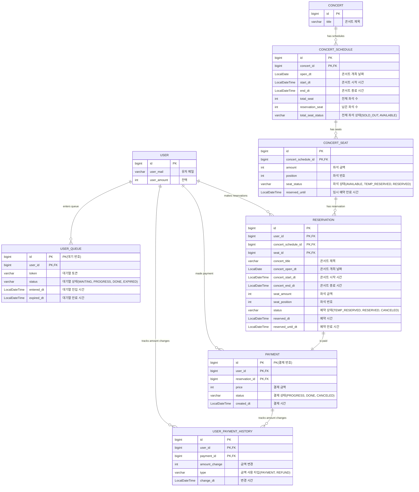

**[ ERD ]**

```mermaid
erDiagram
    USER {
        bigint id PK
        varchar user_mail "유저 메일"
        int user_amount "잔액"
    }

    USER_QUEUE {
        bigint id PK "PK(대기 번호)"
        bigint user_id PK, FK
        varchar token "대기열 토큰"
        varchar status "대기열 상태(WAITING, PROGRESS, DONE, EXPIRED)"
        LocalDateTime entered_dt "대기열 진입 시간"
        LocalDateTime expired_dt "대기열 만료 시간"
    }

    PAYMENT {
        bigint id PK "PK(결제 번호)"
        bigint user_id PK, FK
        bigint reservation_id PK, FK
        int price "결제 금액"
        varchar status "결제 상태(PROGRESS, DONE, CANCELED)"
        LocalDateTime created_dt "결제 시간"
    }

    CONCERT {
        bigint id PK
        varchar title "콘서트 제목"
    }

    CONCERT_SCHEDULE {
        bigint id PK
        bigint concert_id PK, FK
        LocalDate open_dt "콘서트 개최 날짜"
        LocalDateTime start_dt "콘서트 시작 시간"
        LocalDateTime end_dt "콘서트 종료 시간"
        int total_seat "전체 좌석 수"
        int reservation_seat "남은 좌석 수"
        varchar total_seat_status "전체 좌석 상태(SOLD_OUT, AVAILABLE)"
    }

    CONCERT_SEAT {
        bigint id PK
        bigint concert_schedule_id PK, FK
        int amount "좌석 금액"
        int position "좌석 번호"
        varchar seat_status "좌석 상태(AVAILABLE, TEMP_RESERVED, RESERVED)"
        LocalDateTime reserved_until "임시 예약 만료 시간"
    }

    RESERVATION {
        bigint id PK
        bigint user_id PK, FK
        bigint concert_schedule_id PK, FK
        bigint seat_id PK, FK
        varchar concert_title "콘서트 제목"
        LocalDate concert_open_dt "콘서트 개최 날짜"
        LocalDateTime concert_start_dt "콘서트 시작 시간"
        LocalDateTime concert_end_dt "콘서트 종료 시간"
        int seat_amount "좌석 금액"
        int seat_position "좌석 번호"
        varchar status "예약 상태(TEMP_RESERVED, RESERVED, CANCELED)"
        LocalDateTime reserved_dt "예약 시간"
        LocalDateTime reserved_until_dt "예약 만료 시간"
    }

    USER_PAYMENT_HISTORY {
        bigint id PK
        bigint user_id PK, FK
        bigint payment_id PK, FK
        int amount_change "금액 변경"
        varchar type "금액 사용 타입(PAYMENT, REFUND)"
        LocalDateTime change_dt "변경 시간"
    }

    CONCERT ||--o{ CONCERT_SCHEDULE: "has schedules"
    CONCERT_SCHEDULE ||--o{ CONCERT_SEAT: "has seats"
    USER ||--o{ USER_QUEUE: "enters queue"
    USER ||--o{ PAYMENT: "made payment"
    RESERVATION ||--|| PAYMENT: "is paid"
    USER ||--o{ RESERVATION: "makes reservations"
    CONCERT_SEAT ||--o{ RESERVATION: "has reservation"
    USER ||--o{ USER_PAYMENT_HISTORY: "tracks amount changes"
    PAYMENT ||--o{ USER_PAYMENT_HISTORY: "tracks amount changes"
```