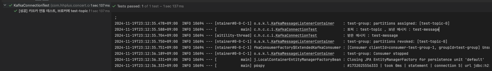

# Spring Boot 애플리케이션에 Kafka 통합하기

## 목차
1. [개요](#1-개요)
2. [환경 설정](#2-환경-설정)
3. [Kafka 설치 및 실행](#3-kafka-설치-및-실행)
4. [Spring Boot 프로젝트 설정](#4-spring-boot-프로젝트-설정)
5. [Kafka 구성](#5-kafka-구성)
6. [테스트 구현](#6-테스트-구현)
7. [문제 해결 가이드](#7-문제-해결-가이드)
8. [참고 사항](#8-참고-사항)

## 1. 개요

### 1.1 프로젝트 목적
- Spring Boot 애플리케이션에 Kafka를 통합
- Producer와 Consumer를 구현하여 메시지 발행 및 구독
- 통합 테스트를 통한 기능 검증

### 1.2 사용 기술 스택
- Spring Boot 3.2.11-SNAPSHOT
- Apache Kafka
- Docker & Docker Compose
- JUnit 5
- TestContainers

## 2. 환경 설정

### 2.1 요구사항
- Java 17 이상
- Docker Desktop

### 2.2 프로젝트 의존성
```gradle
plugins {
    id 'java'
    id 'org.springframework.boot' version '3.2.11-SNAPSHOT'
    id 'io.spring.dependency-management' version '1.1.6'
}

dependencies {
    // Spring Boot Starters
    implementation 'org.springframework.boot:spring-boot-starter-web'
    implementation 'org.springframework.boot:spring-boot-starter-data-jpa'
    implementation 'org.springframework.boot:spring-boot-starter-validation'
    
    // Kafka
    implementation 'org.springframework.kafka:spring-kafka'
    testImplementation 'org.springframework.kafka:spring-kafka-test'
    
    // Test Containers
    testImplementation "org.testcontainers:junit-jupiter"
    testImplementation 'org.testcontainers:kafka'
    
    // Database
    runtimeOnly 'com.h2database:h2'
    
    // Lombok
    compileOnly 'org.projectlombok:lombok'
    annotationProcessor 'org.projectlombok:lombok'
    
    // Test
    testImplementation 'org.springframework.boot:spring-boot-starter-test'
    testImplementation 'org.awaitility:awaitility:4.2.0'
}
```

## 3. Kafka 설치 및 실행

### 3.1 Docker Compose 구성
`docker-compose.yml` 파일을 프로젝트 루트 디렉토리에 생성:

```yaml
version: '3.8'
services:
  zookeeper:
    image: confluentinc/cp-zookeeper:7.5.0
    container_name: zookeeper
    environment:
      ZOOKEEPER_CLIENT_PORT: 2181
      ZOOKEEPER_TICK_TIME: 2000
    ports:
      - "2181:2181"
    networks:
      - kafka-network

  kafka:
    image: confluentinc/cp-kafka:7.5.0
    container_name: kafka
    depends_on:
      - zookeeper
    ports:
      - "29092:29092"
      - "9092:9092"
    environment:
      KAFKA_BROKER_ID: 1
      KAFKA_ZOOKEEPER_CONNECT: zookeeper:2181
      KAFKA_LISTENER_SECURITY_PROTOCOL_MAP: PLAINTEXT:PLAINTEXT,PLAINTEXT_HOST:PLAINTEXT
      KAFKA_ADVERTISED_LISTENERS: PLAINTEXT://kafka:29092,PLAINTEXT_HOST://localhost:9092
      KAFKA_LISTENERS: PLAINTEXT://0.0.0.0:29092,PLAINTEXT_HOST://0.0.0.0:9092
      KAFKA_INTER_BROKER_LISTENER_NAME: PLAINTEXT
      KAFKA_OFFSETS_TOPIC_REPLICATION_FACTOR: 1
      KAFKA_TRANSACTION_STATE_LOG_MIN_ISR: 1
      KAFKA_TRANSACTION_STATE_LOG_REPLICATION_FACTOR: 1
    networks:
      - kafka-network

  kafka-ui:
    image: provectuslabs/kafka-ui:latest
    container_name: kafka-ui
    ports:
      - "8081:8080"
    environment:
      KAFKA_CLUSTERS_0_NAME: local
      KAFKA_CLUSTERS_0_BOOTSTRAPSERVERS: kafka:29092
      KAFKA_CLUSTERS_0_ZOOKEEPER: zookeeper:2181
    depends_on:
      - kafka
    networks:
      - kafka-network

networks:
  kafka-network:
    driver: bridge
```

### 3.2 Docker Compose 실행
```bash
# Docker Compose 실행
docker-compose up -d

# 상태 확인
docker-compose ps

# 로그 확인
docker-compose logs -f
```

### 3.3 Kafka UI 접속
- 브라우저에서 `http://localhost:8081` 접속
- Topics, Brokers, Consumers 등 모니터링 가능


## 4. Spring Boot 프로젝트 설정

### 4.1 Application Properties 구성
테스트용 설정 파일 `src/test/resources/application-test.yml`:

```yaml
spring:
  jpa:
    hibernate:
      ddl-auto: create-drop
    open-in-view: false
    properties:
      hibernate:
        format_sql: true
  datasource:
    driver-class-name: org.h2.Driver
    url: jdbc:h2:mem:testdb;DB_CLOSE_DELAY=-1;DB_CLOSE_ON_EXIT=FALSE
    username: sa
    password:
  kafka:
    bootstrap-servers: ${spring.embedded.kafka.brokers}
    consumer:
      group-id: test-group
      auto-offset-reset: earliest
      key-deserializer: org.apache.kafka.common.serialization.StringDeserializer
      value-deserializer: org.springframework.kafka.support.serializer.JsonDeserializer
      properties:
        spring.json.trusted.packages: "*"
    producer:
      key-serializer: org.apache.kafka.common.serialization.StringSerializer
      value-serializer: org.springframework.kafka.support.serializer.JsonSerializer
```

## 5. Kafka 구성

### 5.1 Kafka 설정 클래스
`KafkaConfig.java`:

```java
package com.hhplus.concert.config;

import lombok.RequiredArgsConstructor;
import org.apache.kafka.clients.admin.NewTopic;
import org.springframework.beans.factory.annotation.Value;
import org.springframework.context.annotation.Bean;
import org.springframework.context.annotation.Configuration;
import org.springframework.kafka.annotation.EnableKafka;

@EnableKafka
@Configuration
@RequiredArgsConstructor
public class KafkaConfig {

    @Value("${spring.kafka.producer.topic.payment-success}")
    private String paymentSuccessTopic;

    @Bean
    public NewTopic paymentSuccessTopic() {
        // 토픽, 생성할 파티션 개수(로드밸런서처럼 라운드-로빈으로 동작함), 레플리케이션팩터(복제본 생성 개수)
        return new NewTopic(paymentSuccessTopic, 3, (short) 1);
    }
}
```

## 6. 테스트 구현

### 6.1 통합 테스트 작성
`KafkaConnectionTest.java`:

```java
@SpringBootTest
@Testcontainers
@ActiveProfiles("test")
@DirtiesContext(classMode = DirtiesContext.ClassMode.AFTER_EACH_TEST_METHOD)
class KafkaConnectionTest {

   private static final Logger log = LoggerFactory.getLogger(KafkaConnectionTest.class);

   @Container
   static final KafkaContainer KAFKA_CONTAINER = new KafkaContainer(DockerImageName.parse("confluentinc/cp-kafka:latest"));

   @Container
   static final GenericContainer<?> REDIS_CONTAINER = new GenericContainer<>("redis:latest")
           .waitingFor(Wait.forListeningPort())
           .withExposedPorts(6379);

   @DynamicPropertySource
   static void overrideProperties(DynamicPropertyRegistry registry) {
      registry.add("spring.kafka.bootstrap-servers", KAFKA_CONTAINER::getBootstrapServers);
      registry.add("spring.data.redis.host", REDIS_CONTAINER::getHost);
      registry.add("spring.data.redis.port", () -> REDIS_CONTAINER.getMappedPort(6379));
   }

   @AfterAll
   public static void stopContainers() {
      log.info("Stopping containers...");
      KAFKA_CONTAINER.stop();
      KAFKA_CONTAINER.stop();
      log.info("Containers stopped successfully.");
   }

   @Autowired
   private KafkaTemplate<String, String> kafkaTemplate;
   private String receivedMessage;


   @Test
   @DisplayName("[성공] 카프카 연동 테스트, 브로커에 test-topic 토픽으로 test-message를 전송하고 최대 10초 대기하면서 listener가 받는 메시지와 일치한지 확인한다.")
   void produceTestMessage() {
      String topic = "test-topic";
      String message = "test-message";

      kafkaTemplate.send(topic, message);
      log.info("토픽 : {} , 보낸 메시지 : {}",topic,message);
      await()
              .atMost(Duration.ofSeconds(10))
              .untilAsserted(() -> {
                 log.info("받은 메시지 : {}", receivedMessage);
                 assertThat(receivedMessage).isEqualTo(message);
              });
   }

   @KafkaListener(topics = "test-topic", groupId = "test-group")
   public void consumeTestMessage(String message) {
      this.receivedMessage = message;
   }

}
```

(테스트 성공 확인)

## 7. 문제 해결 가이드

### 7.1 일반적인 문제 해결
1. Kafka 연결 실패
    - Docker 컨테이너 상태 확인
    - 네트워크 설정 확인
    - 포트 충돌 확인

2. 테스트 실패
    - TestContainers 버전 호환성 확인
    - Docker Desktop 실행 여부 확인
    - 테스트 프로파일 설정 확인

### 7.2 로그 확인 방법
1. Kafka 로그
```bash
docker-compose logs kafka
```

2. 애플리케이션 로그
- IDE의 로그 창 확인
- `application.yml`의 로깅 레벨 조정

### 7.3 디버깅 팁
1. Kafka UI를 통한 모니터링
    - 토픽 생성 확인
    - 메시지 전송/수신 확인
    - Consumer 그룹 상태 확인

2. TestContainers 디버깅
    - `@Container` 인스턴스 로그 확인
    - 컨테이너 시작/종료 로그 확인

## 8. 참고 사항

### 8.1 확장 고려사항
1. 메시지 직렬화
    - JSON 외 다른 형식 지원
    - Schema Registry 도입

2. 장애 대응
    - Dead Letter Queue 구성
    - 재시도 정책 설정

### 8.2 추가 개선 방안
1. 설정 분리
    - 환경별 설정 파일 구성
    - 외부 설정 관리

2. 테스트 강화
    - 다양한 시나리오 테스트
    - 성능 테스트 추가

## 결론

이 가이드는 Spring Boot 애플리케이션에 Kafka를 통합하는 전체 과정을 다루었습니다. Docker를 통한 로컬 환경 구성부터 테스트 작성까지, 실제 프로덕션 환경에서 활용할 수 있는 기본적인 설정과 구현 방법을 제공합니다. 특히 다음과 같은 핵심 내용을 다루었습니다:

- Docker Compose를 통한 Kafka 환경 구성
- Spring Boot와 Kafka 통합 설정
- TestContainers를 활용한 통합 테스트
- 모니터링 및 운영 고려사항

## 부록

###  A. 자주 사용하는 Docker 명령어
```bash
# 컨테이너 상태 확인
docker ps

# 특정 컨테이너 로그 확인
docker logs kafka

# 컨테이너 재시작
docker-compose restart kafka

# 전체 서비스 중지 및 삭제
docker-compose down

# 볼륨 포함하여 전체 초기화
docker-compose down -v

# 특정 서비스만 재빌드
docker-compose up -d --build kafka
```

### B. Kafka CLI 명령어
```bash
# 토픽 리스트 조회
docker exec kafka kafka-topics --list --bootstrap-server localhost:9092

# 토픽 상세 정보 조회
docker exec kafka kafka-topics --describe --topic test-topic --bootstrap-server localhost:9092

# 컨슈머 그룹 리스트 조회
docker exec kafka kafka-consumer-groups --list --bootstrap-server localhost:9092

# 메시지 생산
docker exec -it kafka kafka-console-producer --topic test-topic --bootstrap-server localhost:9092

# 메시지 소비
docker exec -it kafka kafka-console-consumer --topic test-topic --from-beginning --bootstrap-server localhost:9092
```

### C. 트러블슈팅 체크리스트

#### C.1 Kafka 연결 문제
1. Docker 컨테이너 상태 확인
```bash
docker ps
docker-compose ps
```

2. Kafka 로그 확인
```bash
docker logs kafka
```

3. 네트워크 연결 확인
```bash
docker network ls
docker network inspect kafka-network
```

#### C.2 테스트 실패 시 확인사항
1. TestContainers 관련
- Docker Desktop 실행 여부
- TestContainers 버전 호환성
- 테스트 컨테이너 로그 확인

2. 설정 관련
- application-test.yml 설정값 확인
- 프로파일 활성화 여부
- DynamicPropertySource 동작 확인

3. 코드 관련
- KafkaTemplate 주입 확인
- Listener 메서드 실행 여부
- 비동기 테스트 타임아웃 설정


## 참고 문헌
1. Spring for Apache Kafka 공식 문서
    - https://docs.spring.io/spring-kafka/reference/html/

2. Apache Kafka 공식 문서
    - https://kafka.apache.org/documentation/

3. TestContainers 공식 문서
    - https://www.testcontainers.org/modules/kafka/