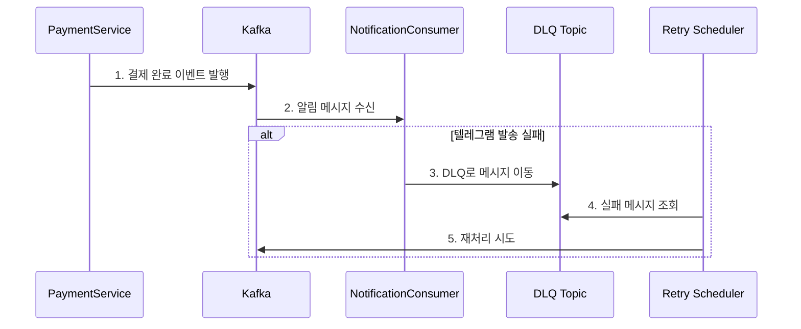
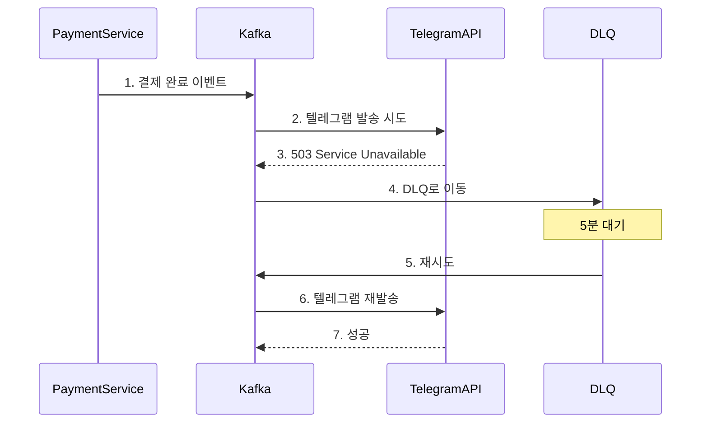
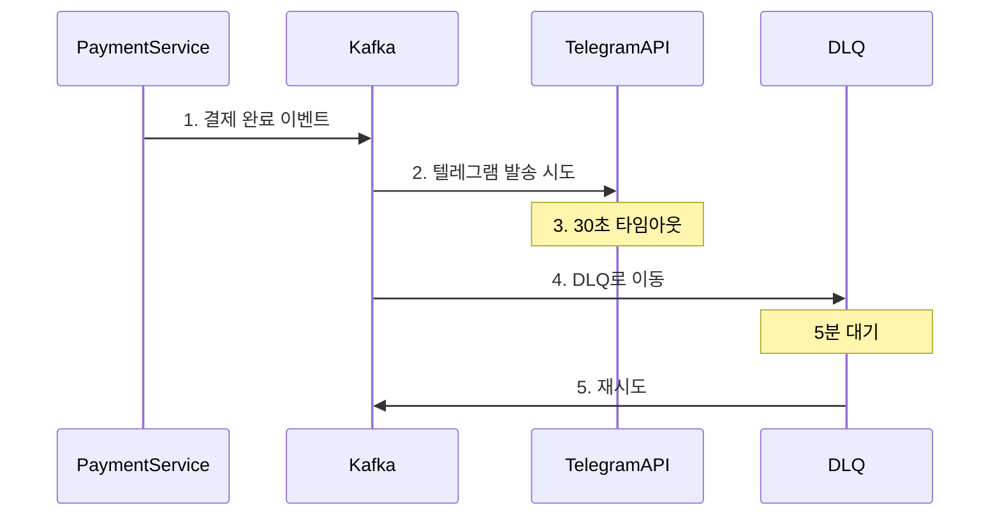

# 결제 알림 시스템의 Kafka 구현 가이드

## 목차
1. [시스템 변경 배경](#1-시스템-변경-배경)
2. [Kafka 기반 알림 시스템 설계](#2-kafka-기반-알림-시스템-설계)
3. [상세 구현](#3-상세-구현)
4. [장애 시나리오](#4-장애-시나리오)
5. [테스트 구현](#5-테스트-구현)

## 1. 시스템 변경 배경

### 기존 시스템 분석
현재 결제 완료 후 텔레그램 알림 발송은 Spring의 이벤트 발행자(ApplicationEventPublisher)를 사용합니다.

```java
@Transactional
public PaymentConcertResult paymentConcert(String token, long reservationId) {
    // ... 결제 처리 로직 ...

    PaymentMessageSendEvent event = new PaymentMessageSendEvent(
        user.getUserMail(), 
        reservation.getConcertTitle(),
        reservation.getConcertStartDt(),
        LocalDateTime.now(),
        reservation.getSeatAmount()
    );
    paymentEventPublisher.paymentMassageSend(event);  // 동기적 이벤트 발행

    return new PaymentConcertResult(...);
}
```

### 현재 시스템의 한계
1. **결제-알림 간 강결합**
   - 텔레그램 서버 장애가 결제 실패로 이어짐
   - 알림 지연이 결제 완료 응답을 지연시킴

2. **장애 대응 한계**
   - 알림 실패 시 재시도 불가
   - 실패한 알림 추적 어려움

## 2. Kafka 기반 알림 시스템 설계

### 2.1 시스템 구조


### 2.2 메시지 처리 흐름


## 3. 상세 구현

### 3.0 컨슈머 설정
```java
@EnableKafka
@Configuration
@RequiredArgsConstructor
@EnableScheduling
public class KafkaPaymentConfig {

    @Value("${spring.kafka.producer.topic.payment-success}")
    private String paymentSuccessTopic;

    @Value("${spring.kafka.producer.topic.payment-fail}")
    private String paymentFailTopic;

    @Value("${spring.kafka.producer.topic.payment-fail-permanent}")
    private String permanentFailTopic;

    @Bean
    public NewTopic paymentSuccessTopic() {
        // 토픽, 생성할 파티션 개수(로드밸런서처럼 라운드-로빈으로 동작함), 레플리케이션팩터(복제본 생성 개수)
        return new NewTopic(paymentSuccessTopic, 3, (short) 1);
    }

    @Bean
    public NewTopic paymentNotificationDlqTopic() {
        return new NewTopic(paymentFailTopic, 3, (short) 1);
    }

    @Bean
    public NewTopic paymentNotificationDlqPermanentTopic() {
        return new NewTopic(permanentFailTopic, 3, (short) 1);
    }

    @Bean
    public DeadLetterPublishingRecoverer deadLetterPublishingRecoverer(KafkaTemplate<Object, Object> template) {
        return new DeadLetterPublishingRecoverer(template, (record, exception) -> new TopicPartition("payment-notification.DLQ", record.partition()));
    }

    @Bean
    public ConcurrentKafkaListenerContainerFactory<String, PaymentMessageSendEvent> kafkaListenerContainerFactory(
            ConsumerFactory<String, PaymentMessageSendEvent> consumerFactory,
            DeadLetterPublishingRecoverer deadLetterPublishingRecoverer) {

        ConcurrentKafkaListenerContainerFactory<String, PaymentMessageSendEvent> factory = new ConcurrentKafkaListenerContainerFactory<>();
        factory.setConsumerFactory(consumerFactory);
        factory.setConcurrency(1);

        // 에러 핸들러 설정
        factory.setCommonErrorHandler(new DefaultErrorHandler(deadLetterPublishingRecoverer, new FixedBackOff(1000L, 3)));

        return factory;
    }
}
```

### 3.1 이벤트 클래스
```java
@Getter
@AllArgsConstructor
public class PaymentCompletedEvent {
    private String mail;
    private String concertTitle;
    private LocalDateTime startDt;
    private LocalDateTime confirmDt;
    private Long amount;
}
```

### 3.2 Producer (결제 서비스)
```java
@Service
@RequiredArgsConstructor
@Slf4j
public class PaymentService {
    private final KafkaTemplate<String, PaymentCompletedEvent> kafkaTemplate;

   @Transactional
   public PaymentConcertResult paymentConcert(String token, long reservationId) {
      long userId = Users.extractUserIdFromJwt(token);
      Users user = userRepository.findById(userId);

      Queue queue = queueRepository.findByToken(token);
      queue.tokenReserveCheck();

      Reservation reservation = reservationRepository.findById(reservationId);
      user.checkConcertAmount(reservation.getSeatAmount());
      
      ConcertSeat concertSeat = concertSeatRepository.findById(reservation.getSeatId());
      concertSeat.finishSeatReserve();

      queue.finishQueue();
      reservation.finishReserve();

      Payment payment = paymentRepository.findByReservationId(reservation.getId());
      payment.finishPayment();

      PaymentHistory paymentHistory = PaymentHistory.enterPaymentHistory(userId, payment.getPrice(), PaymentType.PAYMENT, payment.getId());
      paymentHistoryRepository.save(paymentHistory);

      // 알림 발행
      PaymentMessageSendEvent paymentMessageSendEvent = new PaymentMessageSendEvent(user.getUserMail(), reservation.getConcertTitle(), reservation.getConcertStartDt(), LocalDateTime.now(), reservation.getSeatAmount());
      paymentEventPublisher.paymentMassageSend(paymentMessageSendEvent);

      return new PaymentConcertResult(concertSeat.getAmount(), reservation.getStatus(), queue.getStatus());
   }
}
```

### 3.3 Consumer (알림 서비스)
```java
@Component
@RequiredArgsConstructor
@Slf4j
public class PaymentMessageConsumer {

   private final MessageSender messageSender;
   private static final DateTimeFormatter dateFormatter = DateTimeFormatter.ofPattern("yyyy-MM-dd HH:mm:ss");

   @KafkaListener(
           topics = "payment-notification",
           groupId = "telegram-notification",
           containerFactory = "kafkaListenerContainerFactory"
   )
   public void handlePaymentNotification(PaymentMessageSendEvent event) throws Exception {
      try {
         String message = String.format("""
                         🎫 콘서트 결제가 완료되었습니다!
                         예약자 ID: %s
                         콘서트: %s
                         시작 날짜: %s
                         결제 날짜: %s
                         결제 금액: %d원
                         콘서트 시작 10분전에는 꼭 입장 부탁드립니다!!
                         """,
                 event.mail(),
                 event.concertTitle(),
                 event.startDt().format(dateFormatter),
                 event.confirmDt().format(dateFormatter),
                 event.amount()
         );
         messageSender.sendMessage(message);
      } catch (Exception e) {
         log.error("텔레그램 알림 발송 실패: {}", event.mail(), e);
         throw e;
      }
   }
}
```

### 3.4 재처리 스케줄러
```java
@Slf4j
@Component
@RequiredArgsConstructor
public class PaymentDlqRetryScheduler {

   private final MessageSender messageSender;
   private final KafkaTemplate<String, PaymentMessageSendEvent> kafkaTemplate;
   private static final DateTimeFormatter dateFormatter = DateTimeFormatter.ofPattern("yyyy-MM-dd HH:mm:ss");
   private static final String RETRY_COUNT_HEADER = "retry-count";
   private static final int MAX_RETRY_COUNT = 3;

   @Value("${spring.kafka.bootstrap-servers}")
   private String bootstrapServers;

   @Value("${spring.kafka.consumer.group-id}")
   private String groupId;

   @Value("${spring.kafka.producer.topic.payment-fail}")
   private String dlqTopic;

   @Value("${spring.kafka.producer.topic.payment-fail-permanent}")
   private String permanentFailTopic;

   @Scheduled(fixedDelay = 300000) // 5분마다 실행
   public void processFailedMessages() {
      log.info("DLQ 메시지 재처리 시작");

      Properties props = getProperties();

      try (KafkaConsumer<String, PaymentMessageSendEvent> consumer = new KafkaConsumer<>(props)) {
         consumer.subscribe(Collections.singletonList(dlqTopic));
         log.debug("Subscribed to topic: {}", dlqTopic);

         boolean hasRecords = true;
         while (hasRecords) {
            ConsumerRecords<String, PaymentMessageSendEvent> records = consumer.poll(Duration.ofMillis(1000));

            if (records.isEmpty()) {
               hasRecords = false;
               continue;
            }

            log.debug("Fetched {} records from DLQ", records.count());

            for (ConsumerRecord<String, PaymentMessageSendEvent> record : records) {
               processRecord(record);
               consumer.commitSync();
            }
         }
      } catch (Exception e) {
         log.error("DLQ 메시지 처리 중 예외 발생", e);
      }

      log.info("DLQ 메시지 재처리 완료");
   }

   private void processRecord(ConsumerRecord<String, PaymentMessageSendEvent> record) {
      PaymentMessageSendEvent event = record.value();
      int retryCount = getRetryCount(record);

      if (retryCount >= MAX_RETRY_COUNT) {
         handleMaxRetryExceeded(event);
         return;
      }

      try {
         String message = String.format("""
                         🎫 콘서트 결제가 완료되었습니다!
                         예약자 ID: %s
                         콘서트: %s
                         시작 날짜: %s
                         결제 날짜: %s
                         결제 금액: %d원
                         콘서트 시작 10분전에는 꼭 입장 부탁드립니다!!
                         [재시도 발송 - 시도 횟수: %d]
                         """,
                 event.mail(),
                 event.concertTitle(),
                 event.startDt().format(dateFormatter),
                 event.confirmDt().format(dateFormatter),
                 event.amount(),
                 retryCount + 1
         );

         messageSender.sendMessage(message);
         log.info("DLQ 메시지 재처리 성공 - Mail: {}, Concert: {}, Retry Count: {}",
                 event.mail(), event.concertTitle(), retryCount);

      } catch (Exception e) {
         log.error("DLQ 메시지 재처리 실패 - Mail: {}, Concert: {}, Error: {}, Retry Count: {}",
                 event.mail(), event.concertTitle(), e.getMessage(), retryCount, e);

         // ProducerRecord를 사용하여 헤더를 포함한 메시지 전송
         ProducerRecord<String, PaymentMessageSendEvent> producerRecord = new ProducerRecord<>(dlqTopic, event);
         incrementRetryCount(record.headers(), retryCount).forEach(header -> producerRecord.headers().add(header));
         kafkaTemplate.send(producerRecord);
      }
   }

   private void handleMaxRetryExceeded(PaymentMessageSendEvent event) {
      log.warn("최대 재시도 횟수 초과 - Mail: {}, Concert: {}", event.mail(), event.concertTitle());
      // 영구 실패 토픽으로 이동
      kafkaTemplate.send(permanentFailTopic, event);
   }

   private int getRetryCount(ConsumerRecord<String, PaymentMessageSendEvent> record) {
      Iterator<Header> headers = record.headers().headers(RETRY_COUNT_HEADER).iterator();
      if (headers.hasNext()) {
         Header header = headers.next();
         return Integer.parseInt(new String(header.value(), StandardCharsets.UTF_8));
      }
      return 0;
   }

   private Iterable<Header> incrementRetryCount(Headers existingHeaders, int currentRetryCount) {
      List<Header> headers = new ArrayList<>();
      existingHeaders.forEach(header -> {
         if (!header.key().equals(RETRY_COUNT_HEADER)) {
            headers.add(header);
         }
      });
      headers.add(new RecordHeader(RETRY_COUNT_HEADER,
              String.valueOf(currentRetryCount + 1).getBytes(StandardCharsets.UTF_8)));
      return headers;
   }

   @NotNull
   private Properties getProperties() {
      Properties props = new Properties();
      props.put(ConsumerConfig.BOOTSTRAP_SERVERS_CONFIG, bootstrapServers);
      props.put(ConsumerConfig.GROUP_ID_CONFIG, groupId + "-dlq-retry");
      props.put(ConsumerConfig.KEY_DESERIALIZER_CLASS_CONFIG, StringDeserializer.class.getName());
      props.put(ConsumerConfig.VALUE_DESERIALIZER_CLASS_CONFIG, JsonDeserializer.class.getName());
      props.put(ConsumerConfig.MAX_POLL_RECORDS_CONFIG, 10);
      props.put(ConsumerConfig.ENABLE_AUTO_COMMIT_CONFIG, false);
      props.put(ConsumerConfig.AUTO_OFFSET_RESET_CONFIG, "earliest");
      props.put(JsonDeserializer.TRUSTED_PACKAGES, "*");
      return props;
   }
}
```

## 4. 장애 시나리오

### 시나리오 1: 텔레그램 서버 일시 장애


### 시나리오 2: 네트워크 타임아웃


## 5. 테스트 구현

### 5.1 통합 테스트
```java
    @Nested
@DisplayName("기본 Kafka 메시지 전송 테스트")
class BasicKafkaTests {
   @KafkaListener(topics = "payment-notification", groupId = "test-group")
   void consumeTestMessage(PaymentMessageSendEvent event) {
      receivedEvent = event;
   }

   @Test
   @DisplayName("결제 메시지가 정상적으로 전송되고 수신된다")
   void shouldSendAndReceiveMessage() {
      // when
      kafkaTemplate.send("payment-notification", testEvent);

      // then
      await().atMost(ofSeconds(10))
              .untilAsserted(() -> {
                 assertThat(receivedEvent).isNotNull();
                 assertThat(receivedEvent.mail()).isEqualTo(testEvent.mail());
                 assertThat(receivedEvent.concertTitle()).isEqualTo(testEvent.concertTitle());
              });
   }
}

@Nested
@DisplayName("DLQ 동작 테스트")
class DlqOperationTests {
   @KafkaListener(topics = "payment-notification.DLQ", groupId = "dlq-test-group")
   void consumeDlqMessage(PaymentMessageSendEvent event) {
      dlqReceivedEvent = event;
   }

   @Test
   @DisplayName("메시지 처리 실패 시 DLQ로 이동한다")
   void shouldMoveToDeadLetterQueue() throws Exception {
      // given
      doThrow(new RuntimeException("Simulated failure"))
              .when(messageSender)
              .sendMessage(anyString());

      // when
      kafkaTemplate.send("payment-notification", testEvent);

      // then
      await().atMost(ofSeconds(10))
              .untilAsserted(() -> {
                 assertThat(dlqReceivedEvent).isNotNull();
                 assertThat(dlqReceivedEvent.mail()).isEqualTo(testEvent.mail());
              });
   }
}
```

### 5.2 재처리 테스트
```java
   @Nested
@DisplayName("DLQ 재처리 테스트")
class DlqRetryTests {
   private String testTopic;

   @BeforeEach
   void setUpDlqTopic() {
      testTopic = "payment-notification.DLQ." + UUID.randomUUID();
      ReflectionTestUtils.setField(scheduler, "dlqTopic", testTopic);
   }

   @Test
   @DisplayName("최대 재시도 횟수까지 메시지 재처리를 시도한다")
   void shouldRetryUntilMaxAttempts() throws Exception {
      // given
      doThrow(new RuntimeException("Persistent failure"))
              .when(messageSender)
              .sendMessage(anyString());

      // when
      kafkaTemplate.send(testTopic, testEvent).get();

      // then
      for (int i = 0; i < 3; i++) {  // MAX_RETRY_COUNT
         scheduler.processFailedMessages();
      }

      verify(messageSender, times(3)).sendMessage(anyString());
   }

   @Test
   @DisplayName("재처리 성공 시 정상적으로 처리된다")
   void shouldProcessSuccessfullyOnRetry() throws Exception {
      // given
      AtomicInteger attempts = new AtomicInteger();
      doAnswer(inv -> {
         if (attempts.getAndIncrement() == 0) {
            throw new RuntimeException("First attempt fails");
         }
         return null;
      }).when(messageSender).sendMessage(anyString());

      // when
      kafkaTemplate.send(testTopic, testEvent).get();
      scheduler.processFailedMessages();

      // then
      verify(messageSender, times(2)).sendMessage(anyString());
      assertThat(attempts.get()).isEqualTo(2);
   }

   @Test
   @DisplayName("여러 메시지를 순차적으로 처리한다")
   void shouldProcessMultipleMessagesSequentially() throws Exception {
      // given
      int messageCount = 3;
      for (int i = 0; i < messageCount; i++) {
         PaymentMessageSendEvent event = new PaymentMessageSendEvent(
                 "test" + i + "@example.com",
                 "Concert " + i,
                 LocalDateTime.now().plusDays(7),
                 LocalDateTime.now(),
                 50000L
         );
         kafkaTemplate.send(testTopic, event).get();
      }

      // when
      scheduler.processFailedMessages();

      // then
      verify(messageSender, times(messageCount)).sendMessage(anyString());
   }

   @AfterEach
   void tearDown() {
      reset(messageSender);
   }
}
```