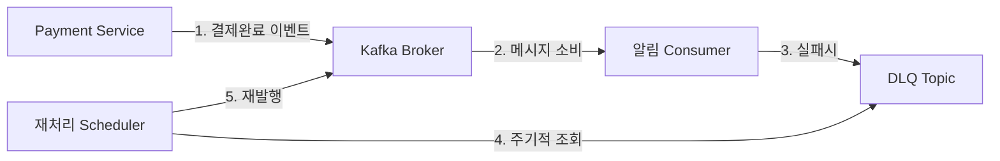
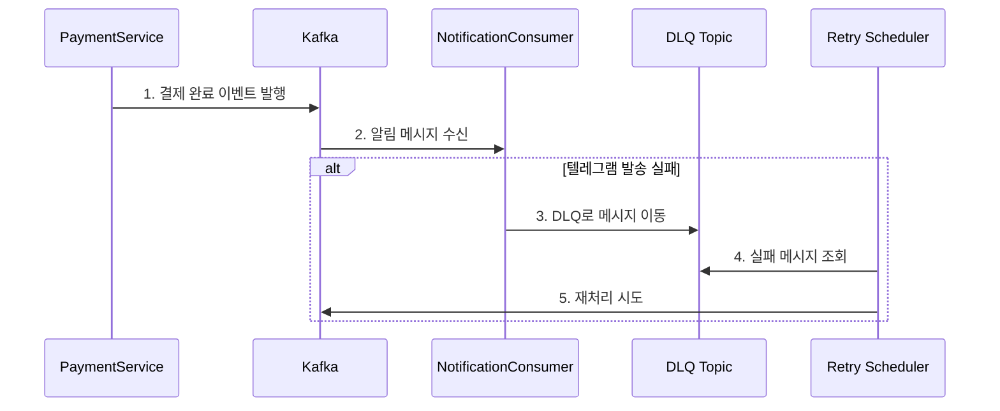
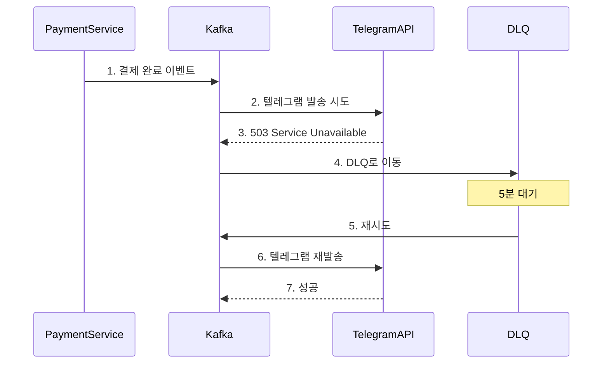
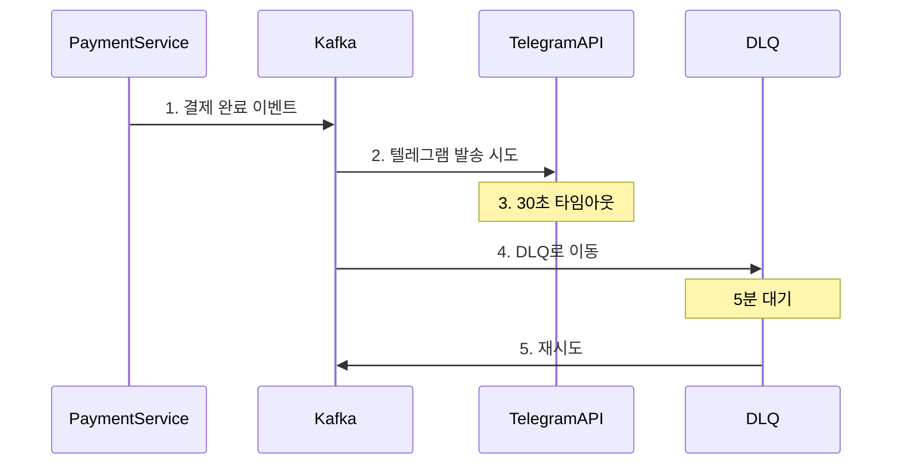

# 결제 알림 시스템의 Kafka 구현 가이드

## 목차
1. [시스템 변경 배경](#1-시스템-변경-배경)
2. [Kafka 기반 알림 시스템 설계](#2-kafka-기반-알림-시스템-설계)
3. [상세 구현](#3-상세-구현)
4. [장애 시나리오](#4-장애-시나리오)
5. [테스트 구현](#5-테스트-구현)

## 1. 시스템 변경 배경

### 기존 시스템 분석
현재 결제 완료 후 텔레그램 알림 발송은 Spring의 이벤트 발행자(ApplicationEventPublisher)를 사용합니다.

```java
@Transactional
public PaymentConcertResult paymentConcert(String token, long reservationId) {
    // ... 결제 처리 로직 ...

    PaymentMessageSendEvent event = new PaymentMessageSendEvent(
        user.getUserMail(), 
        reservation.getConcertTitle(),
        reservation.getConcertStartDt(),
        LocalDateTime.now(),
        reservation.getSeatAmount()
    );
    paymentEventPublisher.paymentMassageSend(event);  // 동기적 이벤트 발행

    return new PaymentConcertResult(...);
}
```

### 현재 시스템의 한계
1. **결제-알림 간 강결합**
   - 텔레그램 서버 장애가 결제 실패로 이어짐
   - 알림 지연이 결제 완료 응답을 지연시킴

2. **장애 대응 한계**
   - 알림 실패 시 재시도 불가
   - 실패한 알림 추적 어려움

## 2. Kafka 기반 알림 시스템 설계

### 2.1 시스템 구조


### 2.2 메시지 처리 흐름


## 3. 상세 구현

### 3.1 이벤트 클래스
```java
@Getter
@AllArgsConstructor
public class PaymentCompletedEvent {
    private String mail;
    private String concertTitle;
    private LocalDateTime startDt;
    private LocalDateTime confirmDt;
    private Long amount;
}
```

### 3.2 Producer (결제 서비스)
```java
@Service
@RequiredArgsConstructor
@Slf4j
public class PaymentService {
    private final KafkaTemplate<String, PaymentCompletedEvent> kafkaTemplate;
    
    @Transactional
    public PaymentConcertResult paymentConcert(String token, long reservationId) {
        // ... 기존 결제 로직 ...

        PaymentCompletedEvent event = new PaymentCompletedEvent(
            user.getUserMail(),
            reservation.getConcertTitle(),
            reservation.getConcertStartDt(),
            LocalDateTime.now(),
            reservation.getSeatAmount()
        );
        
        kafkaTemplate.send("payment-notification", event)
            .addCallback(
                success -> log.info("알림 발행 성공: {}", event.getMail()),
                failure -> log.error("알림 발행 실패: {}", event.getMail(), failure)
            );

        return new PaymentConcertResult(...);
    }
}
```

### 3.3 Consumer (알림 서비스)
```java
@Component
@RequiredArgsConstructor
@Slf4j
public class NotificationConsumer {
    private final MessageSender telegramSender;
    
    @KafkaListener(
        topics = "payment-notification",
        groupId = "telegram-notification",
        errorHandler = "deadLetterQueueErrorHandler"
    )
    public void handlePaymentNotification(PaymentCompletedEvent event) {
        try {
            String message = createTelegramMessage(event);
            telegramSender.sendMessage(message);
            log.info("텔레그램 알림 발송 완료: {}", event.getMail());
        } catch (Exception e) {
            log.error("텔레그램 알림 발송 실패: {}", event.getMail(), e);
            throw new DeadLetterQueueException("텔레그램 발송 실패", e);
        }
    }
}
```

### 3.4 DLQ 처리
```java
@Component
@RequiredArgsConstructor
@Slf4j
public class DeadLetterQueueErrorHandler implements ConsumerAwareListenerErrorHandler {
    private final KafkaTemplate<String, PaymentCompletedEvent> kafkaTemplate;

    @Override
    public Object handleError(Message<?> message, ListenerExecutionFailedException exception,
                            Consumer<?, ?> consumer) {
        log.error("메시지 처리 실패, DLQ로 이동: {}", exception.getMessage());
        kafkaTemplate.send("payment-notification.DLQ", message.getPayload());
        return null;
    }
}
```

### 3.5 재처리 스케줄러
```java
@Component
@RequiredArgsConstructor
@Slf4j
public class RetryScheduler {
    private final KafkaTemplate<String, PaymentCompletedEvent> kafkaTemplate;
    private final ObjectMapper objectMapper;
    
    @Scheduled(fixedDelay = 300000) // 5분마다 실행
    public void processFailedMessages() {
        ConsumerRecords<String, PaymentCompletedEvent> records = 
            kafkaConsumer.poll(Duration.ofSeconds(1));
            
        for (ConsumerRecord<String, PaymentCompletedEvent> record : records) {
            try {
                kafkaTemplate.send("payment-notification", record.value());
                log.info("메시지 재처리 성공: {}", record.value().getMail());
            } catch (Exception e) {
                log.error("메시지 재처리 실패: {}", record.value().getMail(), e);
            }
        }
    }
}
```

## 4. 장애 시나리오

### 시나리오 1: 텔레그램 서버 일시 장애


### 시나리오 2: 네트워크 타임아웃


## 5. 테스트 구현

### 5.1 통합 테스트
```java
@SpringBootTest
@Testcontainers
@ActiveProfiles("test")
class KafkaNotificationIntegrationTest {
    @Container
    static KafkaContainer kafka = new KafkaContainer(
        DockerImageName.parse("confluentinc/cp-kafka:7.3.0")
    );

    @Test
    @DisplayName("결제 완료시 카프카 메시지가 정상 발행되는지 확인")
    void paymentCompletedEventTest() {
        // given
        PaymentCompletedEvent event = new PaymentCompletedEvent(
            "test@mail.com",
            "콘서트",
            LocalDateTime.now().plusDays(7),
            LocalDateTime.now(),
            50000L
        );

        // when
        kafkaTemplate.send("payment-notification", event);

        // then
        ConsumerRecord<String, PaymentCompletedEvent> received = 
            records.poll(Duration.ofSeconds(10));
        assertThat(received.value().getMail()).isEqualTo("test@mail.com");
    }

    @Test
    @DisplayName("텔레그램 발송 실패시 DLQ로 메시지가 이동하는지 확인")
    void deadLetterQueueTest() {
        // given
        PaymentCompletedEvent event = new PaymentCompletedEvent(...);
        mockTelegramServer.givenResponse(500);  // 텔레그램 서버 장애 상황 모킹

        // when
        kafkaTemplate.send("payment-notification", event);

        // then
        ConsumerRecord<String, PaymentCompletedEvent> dlqMessage = 
            dlqConsumer.poll(Duration.ofSeconds(10));
        assertThat(dlqMessage).isNotNull();
        assertThat(dlqMessage.topic()).isEqualTo("payment-notification.DLQ");
    }

    @Test
    @DisplayName("재처리 스케줄러가 DLQ 메시지를 정상적으로 재처리하는지 확인")
    void retrySchedulerTest() {
        // given
        PaymentCompletedEvent event = new PaymentCompletedEvent(...);
        kafkaTemplate.send("payment-notification.DLQ", event);

        // when
        retryScheduler.processFailedMessages();

        // then
        ConsumerRecord<String, PaymentCompletedEvent> retriedMessage = 
            records.poll(Duration.ofSeconds(10));
        assertThat(retriedMessage.topic()).isEqualTo("payment-notification");
    }
}
```

### 5.2 장애 상황 테스트
```java
@Test
@DisplayName("네트워크 타임아웃 발생시 DLQ 처리 확인")
void networkTimeoutTest() {
    // given
    PaymentCompletedEvent event = new PaymentCompletedEvent(...);
    mockTelegramServer
        .givenResponse()
        .withFixedDelay(Duration.ofSeconds(31));  // 30초 타임아웃 설정보다 긴 지연

    // when
    kafkaTemplate.send("payment-notification", event);

    // then
    ConsumerRecord<String, PaymentCompletedEvent> dlqMessage = 
        dlqConsumer.poll(Duration.ofSeconds(40));
    assertThat(dlqMessage).isNotNull();
}

@Test
@DisplayName("재처리 최대 횟수 초과 시 더 이상 재시도하지 않음")
void maxRetryExceededTest() {
    // given
    PaymentCompletedEvent event = new PaymentCompletedEvent(...);
    mockTelegramServer.givenResponse(500);  // 계속 실패하는 상황

    // when
    for (int i = 0; i < 4; i++) {  // 최대 재시도 횟수(3) + 1
        retryScheduler.processFailedMessages();
        Thread.sleep(300000);  // 5분 대기
    }

    // then
    ConsumerRecords<String, PaymentCompletedEvent> records = 
        consumer.poll(Duration.ofSeconds(10));
    assertThat(records.isEmpty()).isTrue();
}
```

### 5.3 성능 테스트
```java
@Test
@DisplayName("대량의 메시지 처리 성능 테스트")
void performanceTest() {
    // given
    int messageCount = 1000;
    CountDownLatch latch = new CountDownLatch(messageCount);
    AtomicInteger successCount = new AtomicInteger(0);

    // when
    IntStream.range(0, messageCount).forEach(i -> {
        PaymentCompletedEvent event = new PaymentCompletedEvent(...);
        kafkaTemplate.send("payment-notification", event)
            .addCallback(
                success -> {
                    successCount.incrementAndGet();
                    latch.countDown();
                },
                failure -> latch.countDown()
            );
    });

    // then
    latch.await(1, TimeUnit.MINUTES);
    assertThat(successCount.get()).isEqualTo(messageCount);
}
```