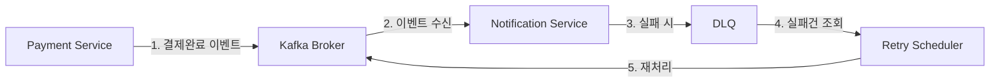
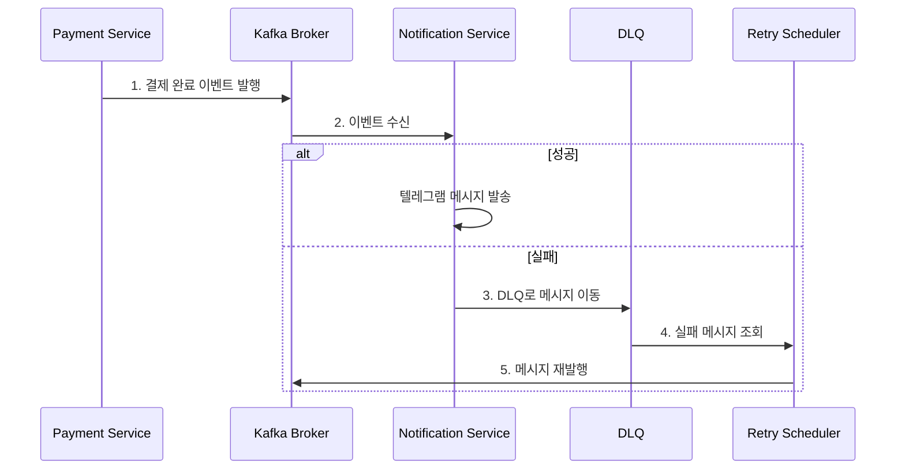

# Apache Kafka와 분산 시스템에서의 메시지 처리 전략

## 개요
실제 애플리케이션에서 카프카를 어떻게 활용할 수 있는지,  
그리고 분산 시스템에서 발생할 수 있는 다양한 문제들을 어떻게 해결할 수 있는지 알아보겠습니다.

## 이벤트 발행자 적용 사례 (kafka로 변경 할 부분)
콘서트 예약 시스템은 현재 Spring의 이벤트 발행자(ApplicationEventPublisher)를 사용하여 결제 완료 후 텔레그램 메시지를 전송하는 구조를 가지고 있습니다.  
이를 카프카를 활용한 분산 메시징 시스템으로 전환하고자 합니다.

## 기존 시스템의 한계점

### 단일 애플리케이션 내 처리
- 모든 로직이 하나의 애플리케이션 내에서 처리됨
- 시스템 확장성에 제한이 있음
- 컴포넌트 간 강한 결합도
- 장애 전파 위험이 높음

### 장애 복구의 한계
- 메시지 전송 실패 시 재시도 메커니즘 부재
- 시스템 장애 시 메시지 유실 가능성
- 실패 이력 추적 불가능
- 장애 상황에 대한 모니터링 어려움

## 시스템 아키텍처



## 카프카 도입 계획

### 1단계: 메시지 발행 시스템 구축
```java
@Service
@RequiredArgsConstructor
public class PaymentService {
    private final KafkaTemplate<String, PaymentCompletedEvent> kafkaTemplate;
    
    @Transactional
    public PaymentConcertResult paymentConcert(String token, long reservationId) {
        // ... 기존 결제 로직 ...
        
        // 카프카로 메시지 발행
        PaymentCompletedEvent event = new PaymentCompletedEvent(
            user.getUserMail(),
            reservation.getConcertTitle(),
            reservation.getConcertStartDt(),
            LocalDateTime.now(),
            reservation.getSeatAmount()
        );
        
        kafkaTemplate.send("payment-completed-topic", event);
        
        return new PaymentConcertResult(/*...*/);
    }
}
```

### 2단계: 컨슈머 애플리케이션 구현
```java
@Component
@RequiredArgsConstructor
@Slf4j
public class PaymentNotificationConsumer {
    private final MessageSender telegramSender;
    private final IdempotentConsumer idempotentConsumer;
    
    @KafkaListener(
        topics = "payment-completed-topic",
        groupId = "notification-group",
        errorHandler = "deadLetterQueueErrorHandler"
    )
    public void handlePaymentCompleted(PaymentCompletedEvent event) {
        try {
            if (idempotentConsumer.processIfNotExists(event.getEventId())) {
                telegramSender.sendMessage(createMessage(event));
                log.info("Payment notification sent successfully for event: {}", event.getEventId());
            } else {
                log.info("Duplicate event ignored: {}", event.getEventId());
            }
        } catch (Exception e) {
            log.error("Failed to process payment notification: {}", e.getMessage());
            throw new DeadLetterQueueException(event, e);
        }
    }
    
    private String createMessage(PaymentCompletedEvent event) {
        return String.format("""
            🎫 콘서트 결제가 완료되었습니다!
            예약자 ID: %s
            콘서트: %s
            시작 날짜: %s
            결제 날짜: %s
            결제 금액: %d원
            콘서트 시작 10분전에는 꼭 입장 부탁드립니다!!
            """,
            event.getMail(),
            event.getConcertTitle(),
            event.getStartDt().format(DateTimeFormatter.ofPattern("yyyy-MM-dd HH:mm:ss")),
            event.getConfirmDt().format(DateTimeFormatter.ofPattern("yyyy-MM-dd HH:mm:ss")),
            event.getAmount()
        );
    }
}
```

### 3단계: Dead Letter Queue (DLQ) 구현
```java
@Component
@RequiredArgsConstructor
@Slf4j
public class DeadLetterQueueErrorHandler implements ConsumerAwareListenerErrorHandler {
    private final KafkaTemplate<String, Object> kafkaTemplate;
    private final FailedMessageRepository failedMessageRepository;
    
    @Override
    public Object handleError(Message<?> message, ListenerExecutionFailedException exception,
                            Consumer<?, ?> consumer) {
        log.error("Message processing failed: {}", exception.getMessage());
        
        // DLQ 토픽으로 메시지 전송
        kafkaTemplate.send("payment-notification-dlq", message.getPayload());
        
        // 실패 이력 저장
        FailedMessage failedMessage = FailedMessage.builder()
            .topic("payment-notification-dlq")
            .payload(message.getPayload().toString())
            .errorMessage(exception.getMessage())
            .status(FailedMessageStatus.PENDING)
            .build();
            
        failedMessageRepository.save(failedMessage);
        
        return null;
    }
}
```

### 4단계: 실패 메시지 관리
```java
@Entity
@Table(name = "failed_messages")
@Getter
@Builder
@NoArgsConstructor
@AllArgsConstructor
public class FailedMessage {
    @Id @GeneratedValue(strategy = GenerationType.IDENTITY)
    private Long id;
    
    private String topic;
    
    @Column(columnDefinition = "TEXT")
    private String payload;
    
    @Column(columnDefinition = "TEXT")
    private String errorMessage;
    
    private int retryCount;
    
    private LocalDateTime lastRetryDate;
    
    @Enumerated(EnumType.STRING)
    private FailedMessageStatus status;
    
    public void incrementRetryCount() {
        this.retryCount++;
        this.lastRetryDate = LocalDateTime.now();
    }
    
    public void setStatus(FailedMessageStatus status) {
        this.status = status;
    }
}

public enum FailedMessageStatus {
    PENDING,
    PROCESSED,
    FAILED
}
```

### 5단계: 재처리 스케줄러
```java
@Component
@RequiredArgsConstructor
@Slf4j
public class FailedMessageProcessor {
    private final KafkaTemplate<String, Object> kafkaTemplate;
    private final FailedMessageRepository failedMessageRepository;
    
    @Scheduled(fixedDelay = 30000) // 30초마다 실행
    public void processFailedMessages() {
        List<FailedMessage> messages = failedMessageRepository
            .findByStatusAndRetryCountLessThan(FailedMessageStatus.PENDING, 3);
            
        log.info("Processing {} failed messages", messages.size());
        
        for (FailedMessage message : messages) {
            try {
                kafkaTemplate.send(message.getTopic(), message.getPayload());
                message.setStatus(FailedMessageStatus.PROCESSED);
                log.info("Successfully reprocessed message ID: {}", message.getId());
            } catch (Exception e) {
                message.incrementRetryCount();
                if (message.getRetryCount() >= 3) {
                    message.setStatus(FailedMessageStatus.FAILED);
                    log.error("Message ID {} failed permanently after {} retries", 
                        message.getId(), message.getRetryCount());
                } else {
                    log.warn("Retry {} failed for message ID: {}", 
                        message.getRetryCount(), message.getId());
                }
            }
            failedMessageRepository.save(message);
        }
    }
}
```

## 구현 시 고려사항

### 메시지 순서 보장
```java
@Configuration
public class KafkaTopicConfig {
    @Bean
    public NewTopic paymentTopic() {
        return TopicBuilder.name("payment-completed-topic")
            .partitions(3)
            .replicas(1)
            .config(TopicConfig.MESSAGE_TIMESTAMP_TYPE_CONFIG, "CreateTime")
            .build();
    }
    
    @Bean
    public NewTopic dlqTopic() {
        return TopicBuilder.name("payment-notification-dlq")
            .partitions(1)
            .replicas(1)
            .build();
    }
}
```

### 멱등성 보장
```java
@Component
@Slf4j
public class IdempotentConsumer {
    private final Set<String> processedMessages = ConcurrentHashMap.newKeySet();
    
    public boolean processIfNotExists(String messageId) {
        boolean added = processedMessages.add(messageId);
        if (!added) {
            log.info("Duplicate message detected: {}", messageId);
        }
        return added;
    }
}
```

## 메시지 처리 흐름



## 결론
카프카를 도입함으로써:

- 시스템 확장성 향상
- 안정적인 메시지 처리
- 효과적인 장애 복구
- 상세한 모니터링 가능

를 기대할 수 있습니다. 다만, 새로운 기술 도입에 따른 운영 복잡도 증가는 피할 수 없는 트레이드오프입니다. <br>
이를 고려하여 단계적인 도입과 충분한 모니터링을 통해 안정적인 시스템을 구축해 나갈 계획입니다.