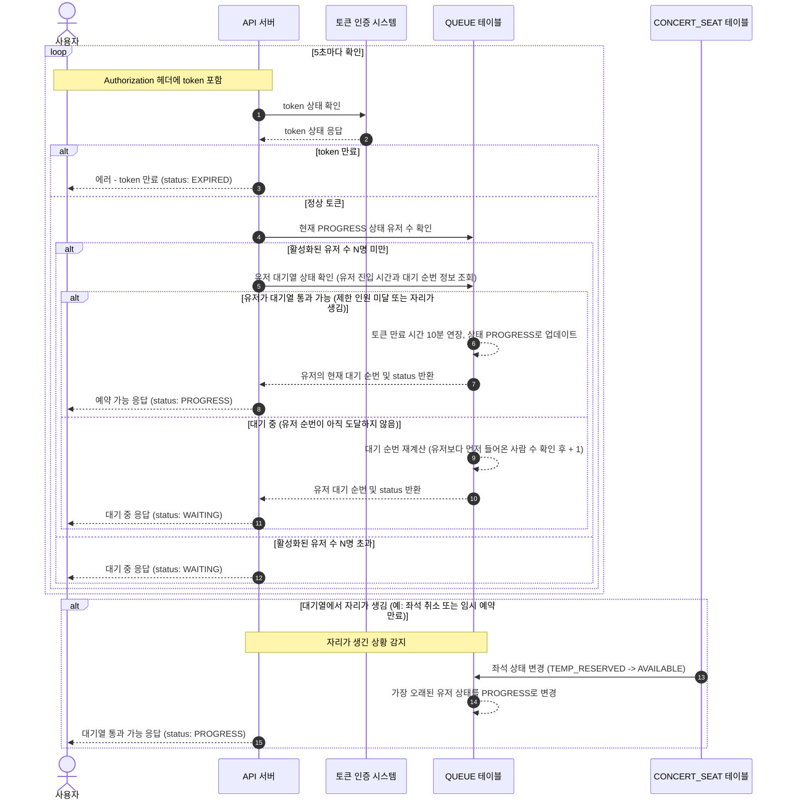
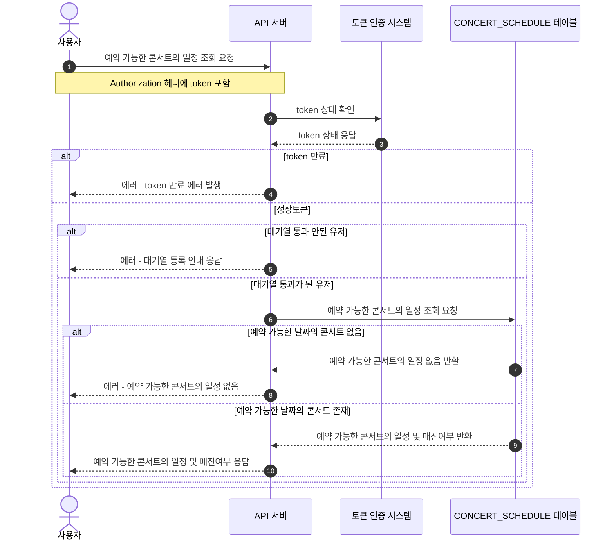
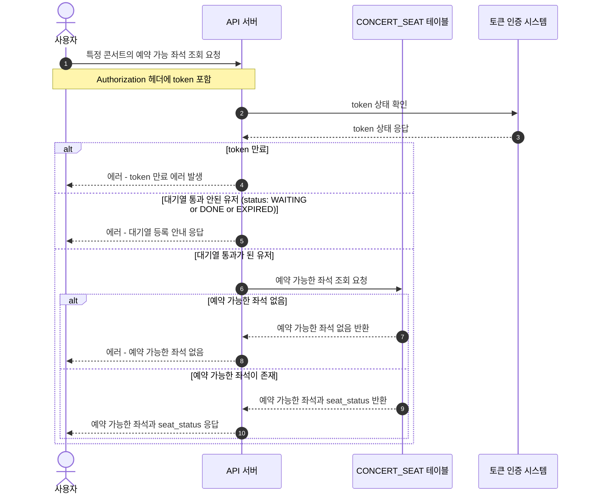
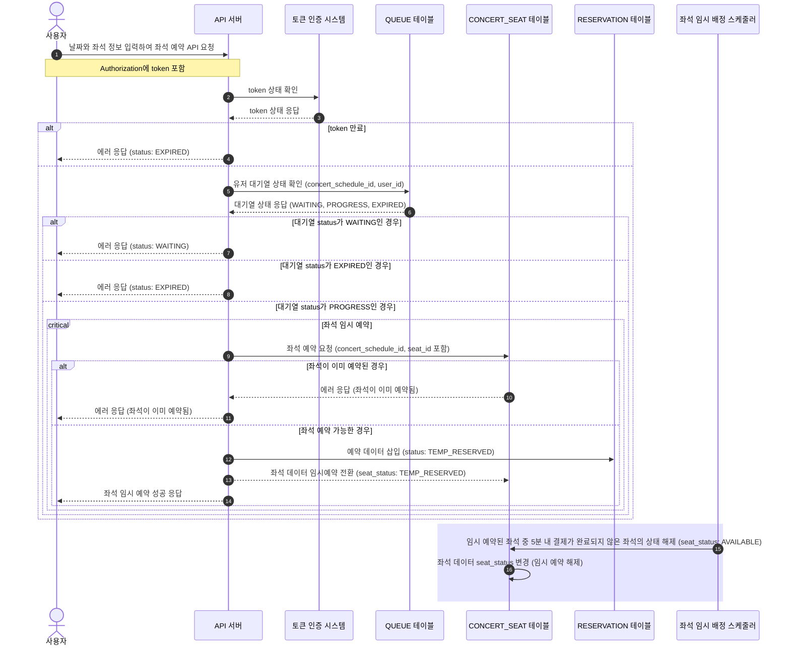
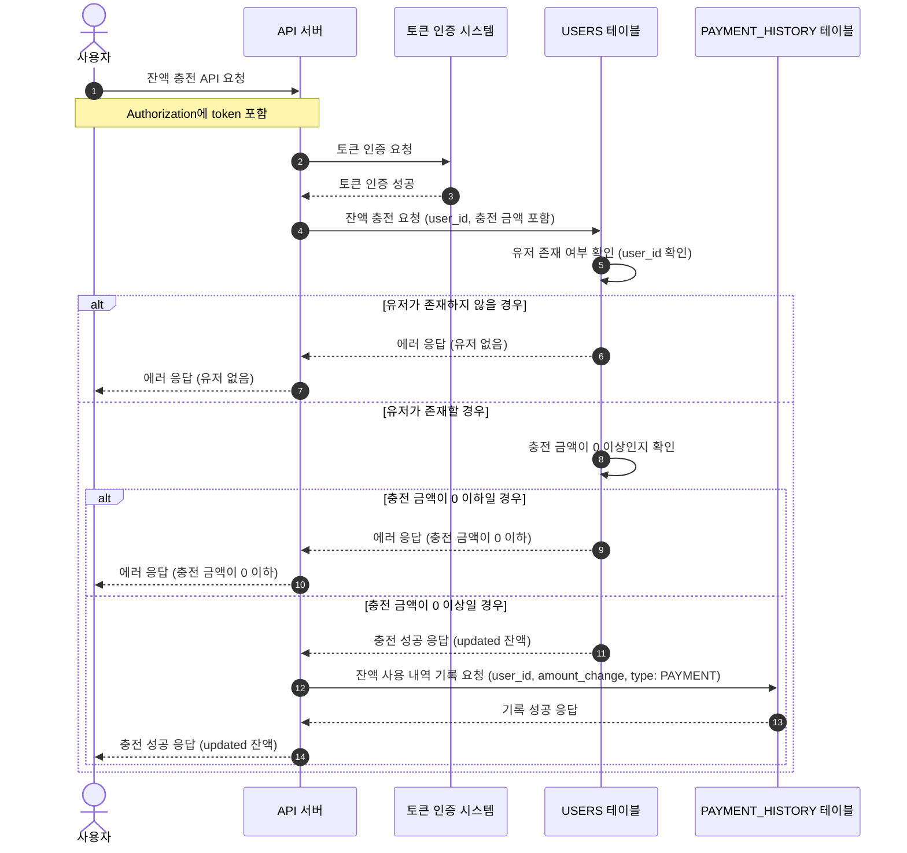
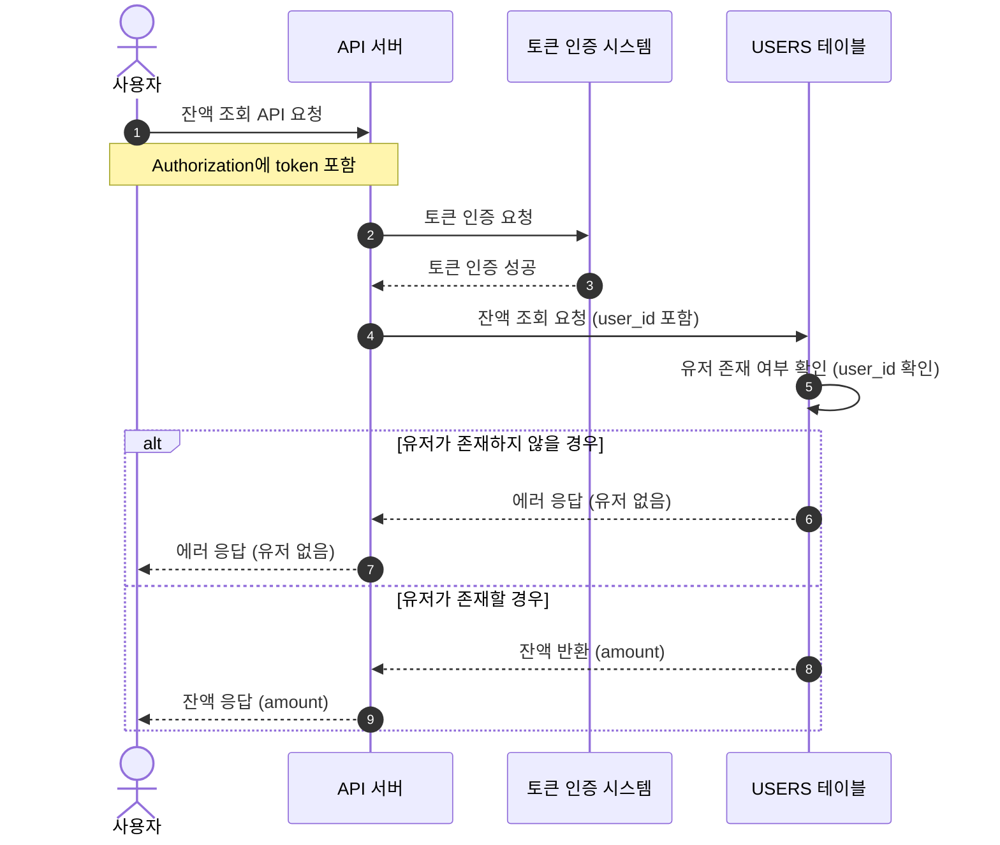
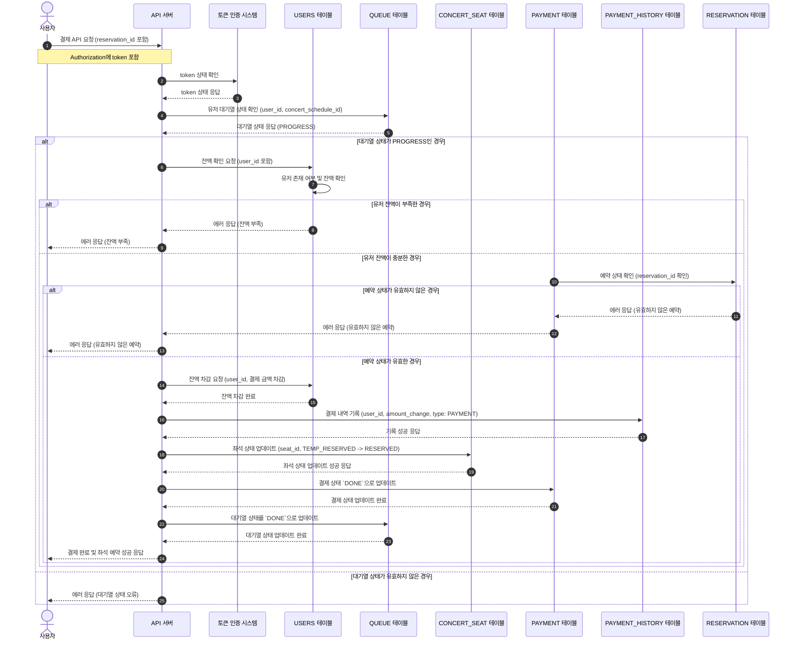

## 시퀀스 다이어 그램

### 유저 대기열 토큰 기능
```mermaid
sequenceDiagram
    autonumber
    actor user as 사용자
    participant server as API 서버
    participant waitingSystem as 대기열 시스템
    participant QUEUE_SCHEDULER as 대기열 토큰만료 스케쥴러
    participant QUEUE as QUEUE 테이블
    user ->> server: 대기열 토큰 발급 요청
    server ->> waitingSystem: 대기열 토큰 발급 요청
    alt 유저가 대기열에 이미 존재
        waitingSystem -->> server: 기존 대기열 토큰 반환
    else 대기열에 새롭게 들어온 경우
        waitingSystem -->> server: 신규 대기열 토큰 생성 및 반환
    end
    server -->> user: 대기열 토큰 반환
~~~~~~~~~~~~~~~~
    rect rgba(0, 0, 255, .1)
        Note over QUEUE_SCHEDULER: 10초에 한번 호출
        QUEUE_SCHEDULER ->> QUEUE: 만료된 대기열 토큰 확인 (현재시간으로 부터 5분 이상 경과한 PROGRESS 상태)
        QUEUE ->> QUEUE: 대기열 상태 `EXPIRED`로 업데이트
    end
```

### 유저 대기열 토큰 체크 (풀링용)


### 예약 가능한 콘서트의 일정 조회 API


### 좌석 조회 API


### 좌석 예약 요청 API


### 잔액 충전 API


### 잔액 조회 API


### 결제 API

