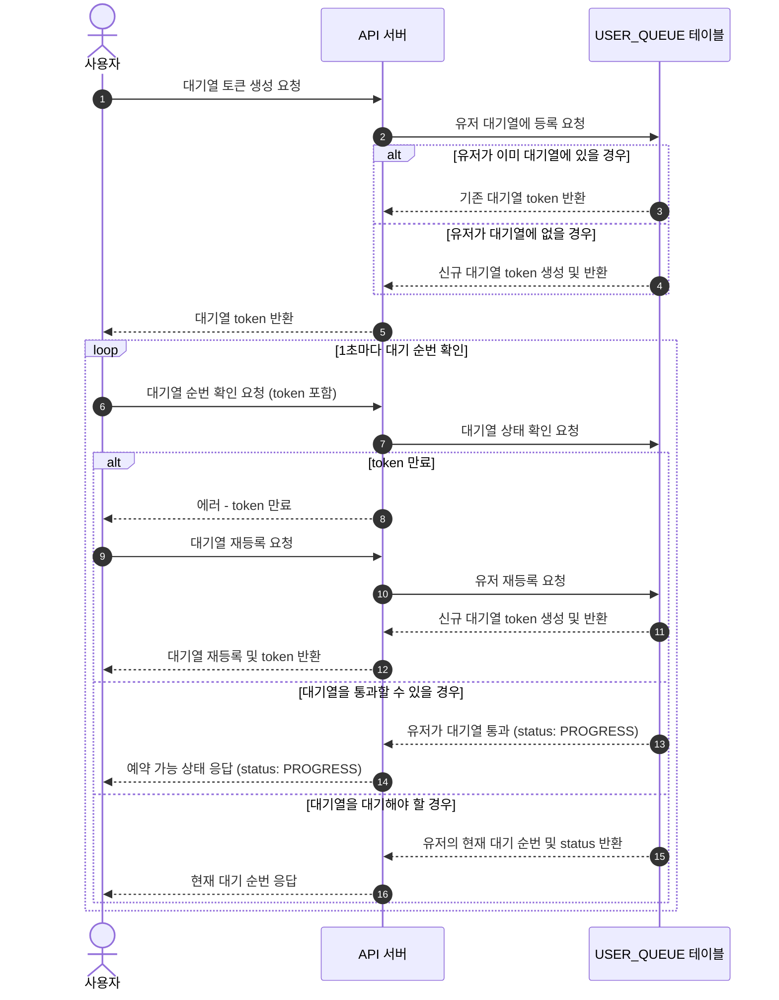
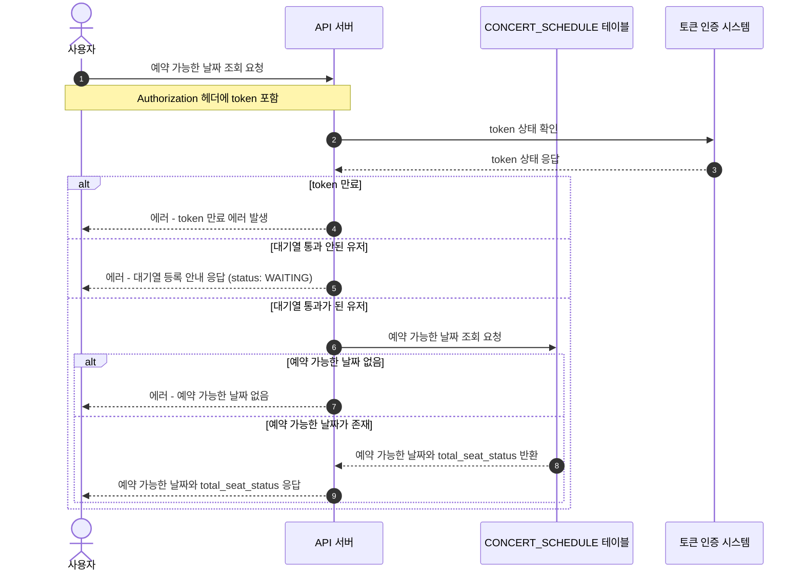
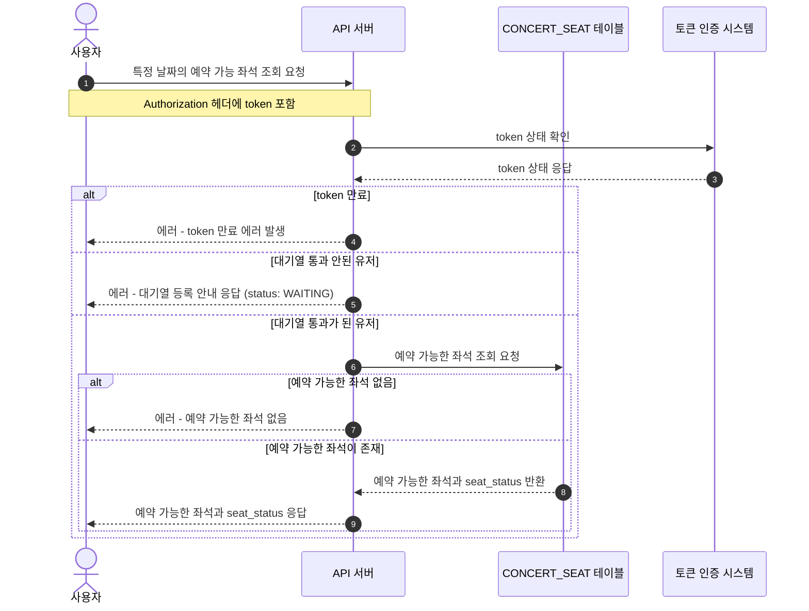
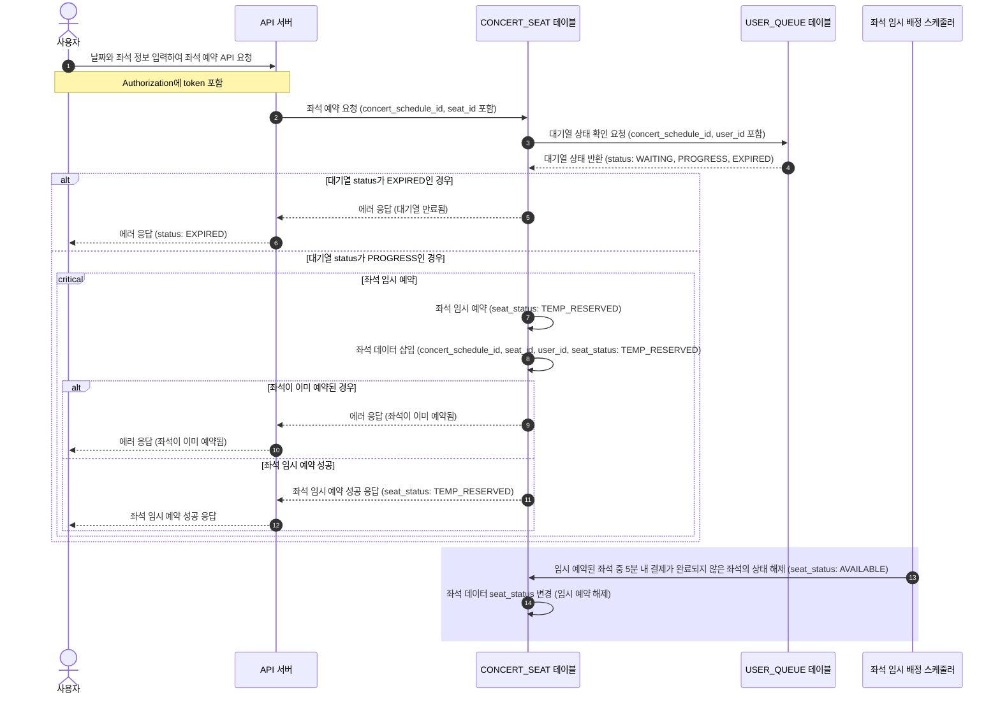
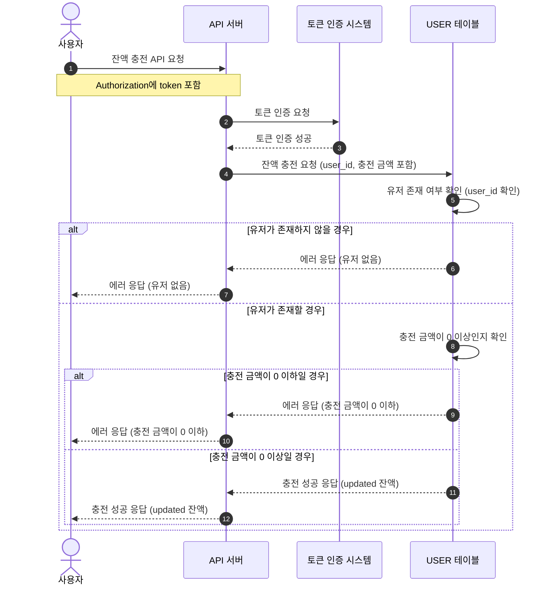

## 시퀀스 다이어 그램

### 유저 대기열 토큰 기능

```mermaid
sequenceDiagram
    autonumber
    actor 사용자 as 사용자
    participant API as API 서버
    participant USER_QUEUE as USER_QUEUE 테이블
    사용자 ->> API: 대기열 토큰 생성 요청
    API ->> USER_QUEUE: 유저 대기열에 등록 요청
    alt 유저가 이미 대기열에 있을 경우
        USER_QUEUE -->> API: 기존 대기열 token 반환
    else 유저가 대기열에 없을 경우
        USER_QUEUE -->> API: 신규 대기열 token 생성 및 반환
    end
    API -->> 사용자: 대기열 token 반환

    loop 1초마다 대기 순번 확인
        사용자 ->> API: 대기열 순번 확인 요청 (token 포함)
        API ->> USER_QUEUE: 대기열 상태 확인 요청
        alt token 만료
            API -->> 사용자: 에러 - token 만료
            사용자 ->> API: 대기열 재등록 요청
            API ->> USER_QUEUE: 유저 재등록 요청
            USER_QUEUE -->> API: 신규 대기열 token 생성 및 반환
            API -->> 사용자: 대기열 재등록 및 token 반환
        else 대기열을 통과할 수 있을 경우
            USER_QUEUE -->> API: 유저가 대기열 통과 (status: PROGRESS)
            API -->> 사용자: 예약 가능 상태 응답 (status: PROGRESS)
        else 대기열을 대기해야 할 경우
            USER_QUEUE -->> API: 유저의 현재 대기 순번 및 status 반환
            API -->> 사용자: 현재 대기 순번 응답
        end
    end
```

### 예약 가능 날짜 조회 API

```mermaid
sequenceDiagram
    autonumber
    actor 사용자 as 사용자
    participant API as API 서버
    participant CONCERT_SCHEDULE as CONCERT_SCHEDULE 테이블
    participant AUTH as 토큰 인증 시스템
    사용자 ->> API: 예약 가능한 날짜 조회 요청
    Note over 사용자, API: Authorization 헤더에 token 포함
    API ->> AUTH: token 상태 확인
    AUTH -->> API: token 상태 응답
    alt token 만료
        API -->> 사용자: 에러 - token 만료 에러 발생
    else 대기열 통과 안된 유저
        API -->> 사용자: 에러 - 대기열 등록 안내 응답 (status: WAITING)
    else 대기열 통과가 된 유저
        API ->> CONCERT_SCHEDULE: 예약 가능한 날짜 조회 요청
        alt 예약 가능한 날짜 없음
            API -->> 사용자: 에러 - 예약 가능한 날짜 없음
        else 예약 가능한 날짜가 존재
            CONCERT_SCHEDULE -->> API: 예약 가능한 날짜와 total_seat_status 반환
            API -->> 사용자: 예약 가능한 날짜와 total_seat_status 응답
        end
    end
```

### 좌석 조회 API

```mermaid
sequenceDiagram
    autonumber
    actor 사용자 as 사용자
    participant API as API 서버
    participant CONCERT_SEAT as CONCERT_SEAT 테이블
    participant AUTH as 토큰 인증 시스템
    사용자 ->> API: 특정 날짜의 예약 가능 좌석 조회 요청
    Note over 사용자, API: Authorization 헤더에 token 포함
    API ->> AUTH: token 상태 확인
    AUTH -->> API: token 상태 응답
    alt token 만료
        API -->> 사용자: 에러 - token 만료 에러 발생
    else 대기열 통과 안된 유저
        API -->> 사용자: 에러 - 대기열 등록 안내 응답 (status: WAITING)
    else 대기열 통과가 된 유저
        API ->> CONCERT_SEAT: 예약 가능한 좌석 조회 요청
        alt 예약 가능한 좌석 없음
            API -->> 사용자: 에러 - 예약 가능한 좌석 없음
        else 예약 가능한 좌석이 존재
            CONCERT_SEAT -->> API: 예약 가능한 좌석과 seat_status 반환
            API -->> 사용자: 예약 가능한 좌석과 seat_status 응답
        end
    end
```

### 좌석 예약 요청 API

```mermaid
sequenceDiagram
    autonumber
    actor 사용자 as 사용자
    participant API as API 서버
    participant CONCERT_SEAT as CONCERT_SEAT 테이블
    participant USER_QUEUE as USER_QUEUE 테이블
    participant SEAT_SCHEDULER as 좌석 임시 배정 스케줄러

    사용자 ->> API: 날짜와 좌석 정보 입력하여 좌석 예약 API 요청
    Note over 사용자, API: Authorization에 token 포함
    API ->> CONCERT_SEAT: 좌석 예약 요청 (concert_schedule_id, seat_id 포함)
    CONCERT_SEAT ->> USER_QUEUE: 대기열 상태 확인 요청 (concert_schedule_id, user_id 포함)
    USER_QUEUE -->> CONCERT_SEAT: 대기열 상태 반환 (status: WAITING, PROGRESS, EXPIRED)

    alt 대기열 status가 EXPIRED인 경우
        CONCERT_SEAT -->> API: 에러 응답 (대기열 만료됨)
        API -->> 사용자: 에러 응답 (status: EXPIRED)
    else 대기열 status가 PROGRESS인 경우
        critical 좌석 임시 예약
            CONCERT_SEAT ->> CONCERT_SEAT: 좌석 임시 예약 (seat_status: TEMP_RESERVED)
            CONCERT_SEAT ->> CONCERT_SEAT: 좌석 데이터 삽입 (concert_schedule_id, seat_id, user_id, seat_status: TEMP_RESERVED)
            alt 좌석이 이미 예약된 경우
                CONCERT_SEAT -->> API: 에러 응답 (좌석이 이미 예약됨)
                API -->> 사용자: 에러 응답 (좌석이 이미 예약됨)
            else 좌석 임시 예약 성공
                CONCERT_SEAT -->> API: 좌석 임시 예약 성공 응답 (seat_status: TEMP_RESERVED)
                API -->> 사용자: 좌석 임시 예약 성공 응답
            end
        end
    end

    rect rgba(0, 0, 255, .1)
        SEAT_SCHEDULER ->> CONCERT_SEAT: 임시 예약된 좌석 중 5분 내 결제가 완료되지 않은 좌석의 상태 해제 (seat_status: AVAILABLE)
        CONCERT_SEAT ->> CONCERT_SEAT: 좌석 데이터 seat_status 변경 (임시 예약 해제)
    end
```

### 잔액 충전 API

```mermaid
sequenceDiagram
    autonumber
    actor 사용자 as 사용자
    participant API as API 서버
    participant AUTH as 토큰 인증 시스템
    participant USER as USER 테이블

    사용자 ->> API: 잔액 충전 API 요청
    Note over 사용자, API: Authorization에 token 포함
    API ->> AUTH: 토큰 인증 요청
    AUTH -->> API: 토큰 인증 성공

    API ->> USER: 잔액 충전 요청 (user_id, 충전 금액 포함)
    USER ->> USER: 유저 존재 여부 확인 (user_id 확인)

    alt 유저가 존재하지 않을 경우
        USER -->> API: 에러 응답 (유저 없음)
        API -->> 사용자: 에러 응답 (유저 없음)
    else 유저가 존재할 경우
        USER ->> USER: 충전 금액이 0 이상인지 확인
        alt 충전 금액이 0 이하일 경우
            USER -->> API: 에러 응답 (충전 금액이 0 이하)
            API -->> 사용자: 에러 응답 (충전 금액이 0 이하)
        else 충전 금액이 0 이상일 경우
            USER -->> API: 충전 성공 응답 (updated 잔액)
            API -->> 사용자: 충전 성공 응답 (updated 잔액)
        end
    end
```

### 잔액 조회 API

```mermaid
sequenceDiagram
    autonumber
    actor 사용자 as 사용자
    participant API as API 서버
    participant AUTH as 토큰 인증 시스템
    participant USER as USER 테이블

    사용자 ->> API: 잔액 조회 API 요청
    Note over 사용자, API: Authorization에 token 포함
    API ->> AUTH: 토큰 인증 요청
    AUTH -->> API: 토큰 인증 성공

    API ->> USER: 잔액 조회 요청 (user_id 포함)
    USER ->> USER: 유저 존재 여부 확인 (user_id 확인)

    alt 유저가 존재하지 않을 경우
        USER -->> API: 에러 응답 (유저 없음)
        API -->> 사용자: 에러 응답 (유저 없음)
    else 유저가 존재할 경우
        USER -->> API: 잔액 반환 (amount)
        API -->> 사용자: 잔액 응답 (amount)
    end
```

