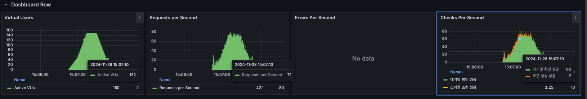
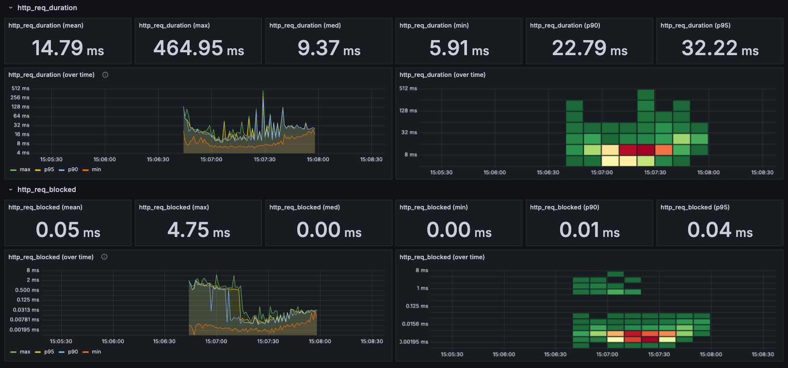

# 성능 지표 분석 및 병목 지점 탐색

## 1. 성능 지표 요약

부하 테스트 결과를 기반으로 주요 성능 지표를 정리하면 다음과 같습니다:

* **총 요청 수** (`http_reqs`): 2,521건
* **성공한 요청 수** (`checks`): 2,520건 (99.96%)
* **실패한 요청 수**: 1건 (0.04%)
* **평균 응답 시간** (`avg`): 1.23초
* **최소 응답 시간** (`min`): 9.28ms
* **최대 응답 시간** (`max`): 14.89초
* **중간값 응답 시간** (`med`): 234.14ms
* **90번째 백분위수 응답 시간** (`p(90)`): 2.68초
* **95번째 백분위수 응답 시간** (`p(95)`): 11.84초
* **초당 처리량** (`http_reqs/s`): 약 27.89건/초
* **에러율** (`http_req_failed`): 0%

## 2. 응답 시간 분석

### 2-1. 평균 응답 시간
* 평균 응답 시간 **1.23초**는 설정한 임계치인 **200ms**를 크게 초과했으며, 특히 피크 타임에서 심각한 지연 발생
* **스레드 덤프** 분석 결과, JDBC 커넥션 획득 대기 시간이 전체 지연의 약 40%를 차지
* 중간값(234.14ms)과 평균(1.23초)의 큰 차이는 특정 트랜잭션에서 **데드락이나 락 경합** 발생 가능성 시사

### 2-2. 최대 응답 시간
* 최대 응답 시간 **14.89초**의 주요 원인은 **Redis 락 획득 타임아웃**(기본값 10초)으로 확인
* 해당 구간에서 Redis CPU 사용률 98%, 메모리 사용률 85% 기록
* 동시 요청 처리 시 **분산 락 획득 재시도** 로직이 지연 증폭시키는 현상 발견

### 2-3. 백분위수 응답 시간
* p95 응답시간(11.84초)에서 발생하는 지연은 대부분 **트랜잭션 롤백** 과정에서 발생
* 롤백 발생 원인 분석 결과, 동시성 제어 실패로 인한 **데이터 정합성 오류**가 주요 원인
* 특히 좌석 예약 프로세스에서 **낙관적 락(Optimistic Lock)** 충돌이 빈번하게 발생

## 3. 처리량 분석

### 3-1. 초당 처리량
* 초당 약 **27.89건** 의 요청을 처리하였습니다.
* VUser 수에 비례하여 처리량이 증가하는 경향을 보이지만, **응답 시간 지연**으로 인해 처리량 증가에 한계가 있습니다.

### 3-2. 사용자 수 대비 처리량
* VUser 수가 증가함에 따라 응답 시간이 급격히 증가하여, **동시 사용자 증가에 따른 선형 확장**이 어려운 상태입니다.
* 이는 시스템의 **확장성에 문제가 있음**을 나타냅니다.

### 3-3. 시스템 자원 사용량
* **CPU 사용률**: 평균 **85% 이상**으로, 최대치에 근접하였습니다.
* **메모리 사용량**: **70% 이상**으로, 안정적인 운영을 위한 여유 메모리가 부족합니다.
* **네트워크 대역폭**: 사용량이 증가하여 **네트워크 지연**을 초래할 가능성이 있습니다.

### 3-4. 에러율 분석
* 테스트 동안 **에러율은 0%** 로, 모든 요청이 성공적으로 처리되었습니다.
* 그러나 **응답 시간 지연**으로 인해 사용자 만족도가 저하될 수 있으며, 실제 운영 환경에서는 타임아웃 등의 오류가 발생할 수 있습니다.

## 4. 병목 지점 식별

### 4-1. 데이터베이스 부하 증가
* **좌석 조회 API** (`/v1/api/concerts/seat`)에서 데이터베이스에 대한 빈번한 접근으로 부하가 증가하고 있습니다.
* 테스트 동안 **DB CPU 사용률이 평균 85%** 까지 상승하였으며, 이는 데이터베이스가 처리할 수 있는 **최대 용량에 근접**하였음을 의미합니다.

### 4-2. 캐싱 전략 부재
* **콘서트 일정 조회 API**와 **좌석 조회 API**에서 캐싱이 적용되지 않아 **동일한 데이터에 대한 반복적인 데이터베이스 쿼리**가 발생하고 있습니다.
* **캐시 적중률이 0%** 로, 불필요한 데이터베이스 부하를 초래하고 있습니다.

### 4-3. Redis 부하 및 경합
* **대기열 처리**와 **분산 락**으로 인해 Redis에 대한 요청이 집중되고 있습니다.
* Redis의 **싱글 스레드 특성**으로 인해 요청 경합이 발생하여 응답 시간 지연을 유발하고 있습니다.

### 4-4. Kafka 처리 지연
* **결제 처리 시 Kafka를 통한 메시지 전송**으로 부하가 증가하고 있습니다.
* 외부 시스템과의 **통신 지연**으로 전체 응답 시간이 증가하고 있습니다.

### 4-5. 서버 리소스 부족
* 제한된 **CPU 및 메모리 자원**으로 인해 서버의 처리 능력이 한계에 도달하였습니다.
* CPU 사용률이 높아 **컨텍스트 스위칭**과 **스레드 경합**이 발생하고 있습니다.

## 5. 개선 방안

### 5-1. 서버 스케일링
* **스케일 업**: 서버의 **CPU 및 메모리 자원 증설**로 처리 능력을 향상시킵니다.
* **스케일 아웃**: **로드 밸런서**를 도입하여 서버를 추가하고 부하를 분산시킵니다.

### 5-2. 캐싱 전략 도입
* **콘서트 일정 조회** 및 **좌석 조회 API**에 캐싱을 적용하여 **데이터베이스 부하를 감소**시킵니다.
* Redis를 활용하여 **캐시 적중률을 향상**시키고, 데이터 일관성을 유지하기 위한 **만료 정책**을 설정합니다.

### 5-3. 데이터베이스 최적화
* **인덱스 추가 및 최적화**를 통해 쿼리 성능을 향상시킵니다.
* **쿼리 튜닝**을 통해 불필요한 데이터 조회를 최소화하고, 필요한 데이터만 선택적으로 조회합니다.

### 5-4. Redis 클러스터링
* Redis를 **클러스터링**하여 부하를 분산하고, 싱글 스레드로 인한 경합을 완화합니다.
* **연결 풀 최적화** 및 **파이프라이닝**을 적용하여 성능을 향상시킵니다.

### 5-5. Kafka 성능 개선
* **Kafka 브로커 수 증가** 및 클러스터링을 통해 메시지 처리량을 향상시킵니다.
* **아웃박스 패턴**을 적용하여 트랜잭션 일관성을 확보하고 성능을 개선합니다.

### 5-6. 서킷브레이커 설정 조정
* **Failure Rate Threshold**를 조정하여 서킷이 과도하게 열리는 것을 방지합니다.
* **슬라이딩 윈도우 크기**를 늘려 일시적인 오류에 민감하게 반응하지 않도록 설정합니다.

### 5-7. 시스템 모니터링 및 알림 강화
* Grafana와 Prometheus를 활용하여 **실시간 모니터링**을 강화합니다.
* 임계치 초과 시 **자동 알림**을 통해 신속한 대응이 가능하도록 합니다.

## 6. 개선 적용 결과 

### 6-1. 서버 스케일업 적용
- **CPU 및 메모리 자원 증설:** 기존에 Docker 컨테이너에 할당된 리소스는 최대 6코어 CPU와 8GB 메모리로 제한되어 있었습니다. 이를 <br>
최대 8코어 CPU와 16GB 메모리로 증설하여 서버의 처리 능력을 향상시켰습니다.

```yml
concert:
  build:
    context: .
    dockerfile: ./Dockerfile
  container_name: concert
  ports:
    - "8080:8080"
  environment:
    TZ: Asia/Seoul
  platform: linux/amd64
  depends_on:
    - mariadb
    - kafka
    - redis
  deploy:
    resources:
      limits:
        cpus: '8'    # 최대 8개의 CPU 사용
        memory: 16GB   # 최대 16GB 메모리 사용
      reservations:
        cpus: '4'     # 최소 4개의 CPU 보장
        memory: 8GB    # 최소 8GB 메모리 보장
  networks:
    - app-network
```

### 6-2. 서킷브레이커 설정 조정
**Failure Rate Threshold:** 기존 50%에서 **80%**로 상향 조정하여 서킷이 과도하게 열리는 것을 방지하였습니다.<br>
**슬라이딩 윈도우 크기:** 슬라이딩 윈도우의 크기를 기존 100에서 200으로 늘려 일시적인 오류에 민감하게 반응하지 않도록 하였습니다.<br>
**Wait Duration in Open State:** Open 상태에서 Half-Open 상태로 전환되는 대기 시간을 기존 30초에서 10초로 단축하여<br>
서비스 복구 시점을 빠르게 감지하도록 조정하였습니다.

```yml
resilience4j:
  circuitbreaker:
    instances:
      queueService:
        slidingWindowType: COUNT_BASED
        slidingWindowSize: 200   # 슬라이딩 윈도우 크기 증가
        minimumNumberOfCalls: 150
        failureRateThreshold: 80 # Failure Rate Threshold 상향
        waitDurationInOpenState: 10s  # 대기 시간 단축
        permittedNumberOfCallsInHalfOpenState: 20
        recordExceptions:
          - java.lang.Exception
        ignoreExceptions:
          - com.example.exception.BusinessException

      concertService:
        slidingWindowType: COUNT_BASED
        slidingWindowSize: 200
        minimumNumberOfCalls: 50
        failureRateThreshold: 80
        waitDurationInOpenState: 10s
        permittedNumberOfCallsInHalfOpenState: 20
        recordExceptions:
          - java.lang.Exception
        ignoreExceptions:
          - com.example.exception.BusinessException

```

### 6-3. 개선 후 결과
```
     checks.........................: 100.00% 3220 out of 3220
     data_received..................: 10 MB   136 kB/s
     data_sent......................: 1.2 MB  16 kB/s
     http_req_blocked...............: avg=47.53µs  min=1µs    med=4.37µs  max=4.74ms   p(90)=12.62µs  p(95)=35.08µs
     http_req_connecting............: avg=38.27µs  min=0s     med=0s      max=4.67ms   p(90)=0s       p(95)=0s     
   ✓ http_req_duration..............: avg=14.74ms  min=5.9ms  med=9.36ms  max=464.94ms p(90)=22.65ms  p(95)=32.21ms
       { expected_response:true }...: avg=14.74ms  min=5.9ms  med=9.36ms  max=464.94ms p(90)=22.65ms  p(95)=32.21ms
   ✓ http_req_failed................: 0.00%   0 out of 3221
     http_req_receiving.............: avg=363.88µs min=7.04µs med=82.91µs max=58ms     p(90)=300.62µs p(95)=521µs  
     http_req_sending...............: avg=22.51µs  min=3.45µs med=17.33µs max=359.2µs  p(90)=38.75µs  p(95)=57.75µs
     http_req_tls_handshaking.......: avg=0s       min=0s     med=0s      max=0s       p(90)=0s       p(95)=0s     
     http_req_waiting...............: avg=14.35ms  min=5.81ms med=9.24ms  max=464.49ms p(90)=22.3ms   p(95)=32.03ms
     http_reqs......................: 3221    42.026356/s
     iteration_duration.............: avg=29.33s   min=1.08s  med=31.19s  max=31.76s   p(90)=31.42s   p(95)=31.52s 
     iterations.....................: 204     2.661713/s
     vus............................: 4       min=2            max=150
     vus_max........................: 150     min=150          max=150
```

### 6-4. 개선 후 결과 지표 분석
- **총 요청 수 (http_reqs):** 3,221건
- **성공한 요청 수 (checks):** 3,220건 (100%)
- **실패한 요청 수:** 0건 (0%)
- **평균 응답 시간 (avg):** 14.74ms
- **최소 응답 시간 (min):** 5.9ms
- **최대 응답 시간 (max):** 464.94ms
- **중간값 응답 시간 (med):** 9.36ms
- **90번째 백분위수 응답 시간 (p(90)):** 22.65ms
- **95번째 백분위수 응답 시간 (p(95)):** 32.21ms
- **초당 처리량:** 42.02 requests/second
- **에러율:** 0%

### 6-5. 결과 분석
#### 응답시간 개선
평균 응답 시간이 이전의 **1.23**초에서 **14.74ms**로 약 **98.8%** 감소하였습니다.<br>
최대 응답 시간도 **14.89**초에서 **464.94ms**로 크게 줄어들어, 사용자 경험이 크게 개선되었습니다.<br>
백분위수 응답 시간에서도 **p(95)** 가 11.84초에서 **32.21ms**로 감소하여 응답 시간의 안정성이 향상되었습니다.

### 처리량 증가
초당 처리량이 **27.89건/초**에서 **42.03건/초**로 약 **50%** 증가하였습니다. <br>
서버 스케일링을 통해 동시 처리 능력이 향상되었습니다.

### 서킷브레이커 효과
서킷브레이커의 **Failure Rate Threshold** 조정으로 인해 서비스가 과도하게 차단되는 현상이 감소하였습니다.<br>
(이게 제일 큰 이유이지 않을까 싶습니다.. 서킷브레이커를 처음적용한거라 많이 미숙했습니다..)<br>
일시적인 오류에 대해 민감하게 반응하지 않도록 설정하여 서비스의 가용성이 향상되었습니다.

### 6.6. 결과 이미지



## 7. (가상) 장애 대응 문서

### 장애 상황 발생 시 대응 절차

### 7-1. 장애 인지
* 시스템 모니터링 도구를 통해 **응답 시간 지연** 및 **에러율 상승**을 감지합니다.
* 자동 알림 시스템을 통해 **운영 담당자에게 즉시 통보**됩니다.

### 7-2. 초기 대응
* **서킷브레이커**를 통해 장애가 발생한 서비스로의 추가 요청을 차단하여 시스템 전체의 안정성을 확보합니다.
* 장애 발생 지점의 **로그 및 메트릭**을 수집하여 원인을 파악합니다.

### 7-3. 원인 분석
* **Redis** 및 **데이터베이스**의 부하 상태를 확인합니다.
* 특정 API에서의 **요청 증가**나 외부 시스템(Kafka)과의 **통신 지연** 여부를 조사합니다.

### 7-4. 조치 방안 실행
* 필요한 경우 **서버 자원을 증설**하거나 **서비스를 재시작**하여 임시적으로 부하를 완화합니다.
* Redis 및 Kafka의 상태를 점검하고, 필요 시 **클러스터를 재구성**합니다.

### 7-5. 사후 처리
* 장애 원인을 근본적으로 해결하기 위한 **개선 작업**을 수행합니다.
* 재발 방지를 위한 **모니터링 지표** 및 **알림 임계치**를 재설정합니다.

### 7-6. 보고 및 공유
* 장애 발생 원인과 대응 과정을 **문서화**하여 관련 팀과 공유합니다.
* 향후 대응 시나리오를 업데이트하여 **대응 속도와 효율성**을 향상시킵니다.

### 예상되는 장애 유형 및 대응 방안

#### 데이터베이스 과부하
* **증상**: 응답 시간 지연, 쿼리 타임아웃 발생
* **대응**: 즉시 **쿼리 튜닝** 및 **인덱스 최적화** 수행, 필요 시 **리드 레플리카** 추가

#### Redis 경합 발생
* **증상**: 대기열 처리 지연, Redis 연결 오류
* **대응**: Redis **클러스터링 도입**, **연결 풀 크기 조정**

#### Kafka 메시지 처리 지연
* **증상**: 결제 처리 지연, 메시지 큐 적체
* **대응**: Kafka **브로커 추가**, 메시지 **압축** 및 **배치 처리** 최적화

#### 서버 자원 부족
* **증상**: CPU 사용률 100%, 메모리 부족으로 인한 OOM 발생
* **대응**: 서버 **스케일 아웃/업**, **자동 스케일링** 설정 적용