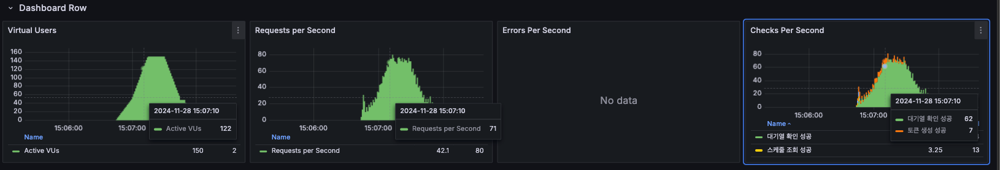
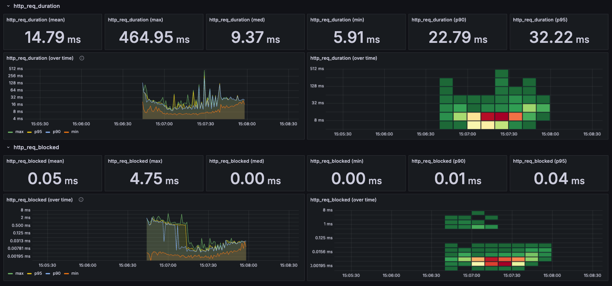
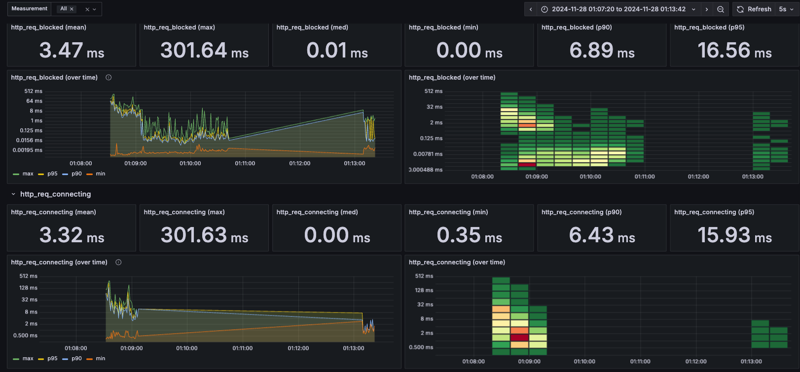
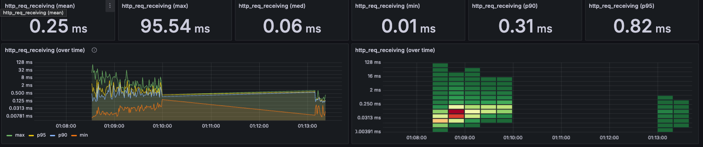
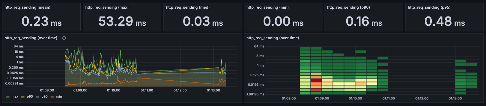
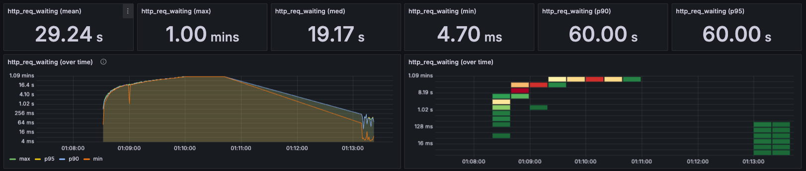

# 📊 부하 테스트 대상 API 선정 문서

## 📌 들어가면서

Concert Reservation 시스템은 많은 사용자가 동시에 접근하여 공연 예약을 시도하는 환경에서 안정적으로 동작해야 합니다.<br> 본 보고서는 시스템의 성능과 안정성을 평가하기 위해 수행한 부하 테스트와 서킷브레이커 패턴의 구현 및 효과를 다룹니다.<br> 이를 통해 시스템의 병목 지점을 식별하고 개선 방안을 제시하여, 향후 더 나은 성능과 안정성을 확보하고자 합니다.

## 1. 전체 API 현황

현재 서비스는 5개의 핵심 도메인으로 구성되어 있습니다.

### 🔄 큐 서비스
| Method | Endpoint | 설명 |
|--------|----------|------|
| POST | `/v1/api/queue/token` | 유저 대기열 토큰 발급 API |
| POST | `/v1/api/queue/token/check` | 유저 대기열 토큰 체크 API |

### 👤 유저 서비스
| Method | Endpoint | 설명 |
|--------|----------|------|
| POST | `/v1/api/user/amount` | 유저 요금 충전 API |
| GET | `/v1/api/user/amount` | 유저 요금 조회 API |

### 🎭 콘서트 서비스
| Method | Endpoint | 설명 |
|--------|----------|------|
| GET | `/v1/api/concerts/schedule` | 예약 가능 콘서트 일정 조회 API |
| GET | `/v1/api/concerts/seat` | 해당 콘서트 일정에 맞는 좌석 조회 API |

### 🎫 예약 서비스
| Method | Endpoint | 설명 |
|--------|----------|------|
| POST | `/v1/api/concerts/reserve` | 해당 콘서트 좌석 임시예약 API (5분) |

### 💳 결제 서비스
| Method | Endpoint | 설명 |
|--------|----------|------|
| POST | `/v1/api/concerts/payment` | 결제완료 후 좌석예약 API |

## 2. 부하 테스트 대상 API 선정

### 선정 기준
- 동시성 이슈 발생 가능성
- 데이터베이스 부하 영향도
- 실제 서비스에서의 트래픽 집중도
- SPOF(Single Point of Failure) 가능성

### 2-1. 대기열 토큰 발급 API (POST /v1/api/queue/token)
- **선정 이유**:
    - 티켓 오픈 시점에 가장 높은 동시 접속 예상
    - 대기열 시스템의 진입점으로 SPOF 가능성 존재
    - 시스템 전반의 안정성에 직접적 영향
- **테스트 포인트**:
    - 최대 동시 접속자 처리 능력
    - 토큰 생성 시 발생하는 부하
    - 시스템 자원 사용량

### 2-2. 대기열 토큰 체크 API (POST /v1/api/queue/token/check)
- **선정 이유**:
    - 지속적인 폴링으로 인한 서버 부하 발생
    - 대기열 시스템의 핵심 기능
    - 실시간 처리 필요
- **테스트 포인트**:
    - 동시 다발적 폴링 요청 처리 능력
    - 응답 시간의 일관성
    - 서버 리소스 사용량

### 2-3. 콘서트 일정 조회 API (GET /v1/api/concerts/schedule)
- **선정 이유**:
    - 캐싱 전략의 효율성 검증 필요
    - 데이터 정합성 유지 중요
    - 다수 사용자의 동시 조회 예상
- **테스트 포인트**:
    - 캐시 히트율
    - 데이터베이스 부하
    - 응답 시간

### 2-4. 좌석 조회 API (GET /v1/api/concerts/seat)
- **선정 이유**:
    - 실시간 좌석 데이터 조회로 인한 DB 부하
    - 데이터 일관성 유지 중요
    - 동시 조회 시 성능 저하 가능성
- **테스트 포인트**:
    - 데이터베이스 연산 처리 능력
    - 동시 조회 시 응답 시간
    - 데이터 정합성


## 3. 테스트 목표

- **성능 지표 평가:** 응답 시간, 처리량, 에러율 등의 성능 지표를 측정하여 시스템의 현재 성능을 파악합니다.
- **병목 구간 식별:** 부하 테스트를 통해 시스템 내 잠재적인 병목 지점을 발견하고 분석합니다.
- **서킷브레이커 패턴 검증:** 서킷브레이커를 적용하여 장애 발생 시 시스템의 안정성을 확인합니다.
- **확장성 확인:** 높은 동시 사용자 환경에서도 시스템이 안정적으로 동작하는지 평가합니다.

## 4. 테스트 환경

### 4-1 하드웨어 및 소프트웨어 사양

- **하드웨어:** M1 MacBook (16GB RAM)
- **운영체제:** macOS Monterey
- **백엔드 프레임워크:** Spring Boot 3.2
- **데이터베이스:** MariaDB 10.5
- **캐시 서버:** Redis 6.2
- **메시징 시스템:** Kafka 7.5.0
- **데이터 수집 및 시각화:** InfluxDB 1.8, Grafana 최신 버전
- **부하 테스트 도구:** K6

### 4-2 네트워크 구성

Docker를 이용하여 각 서비스를 컨테이너로 실행하였으며, Docker Compose를 통해 네트워크를 구성하였습니다.

#### **Docker 컨테이너 목록:**
```
IMAGE                             COMMAND                      STATUS       PORTS                                              NAMES
grafana/grafana:latest            "/run.sh"                  Up 6 hours   0.0.0.0:3000->3000/tcp                             grafana
provectuslabs/kafka-ui:latest     "/bin/sh -c 'java --…"     Up 6 hours   0.0.0.0:8081->8080/tcp                             kafka-ui
redis:6.2                         "docker-entrypoint.s…"     Up 6 hours   0.0.0.0:6379->6379/tcp                             redis
mariadb:10.5                      "docker-entrypoint.s…"     Up 6 hours   0.0.0.0:3306->3306/tcp                             mariadb
confluentinc/cp-kafka:7.5.0       "/etc/confluent/dock…"     Up 6 hours   0.0.0.0:9092->9092/tcp, 0.0.0.0:29092->29092/tcp   kafka
influxdb:1.8                      "/entrypoint.sh infl…"     Up 6 hours   0.0.0.0:8086->8086/tcp                             influxdb
confluentinc/cp-zookeeper:7.5.0   "/etc/confluent/dock…"     Up 6 hours   2888/tcp, 0.0.0.0:2181->2181/tcp, 3888/tcp         zookeeper
```

## 5. 테스트 시나리오
### 5-1 시나리오 개요

- **사용자 수:** 10만 명의 회원을 시뮬레이션
- **테스트 대상 API:**
- **토큰 발급:** `/queue/token`
- **대기열 상태 확인:** `/queue/token/check`
- **콘서트 스케줄 조회:** `/concerts/schedule`
- **좌석 조회:** `/concerts/seat`

### 5-2 K6 부하 테스트 스크립트

```javascript
import http from 'k6/http';
import { check, sleep } from 'k6';

export const options = {
  scenarios: {
      concert_reservation: {
          executor: 'ramping-vus',
          startVUs: 10,
          stages: [
              { duration: '10s', target: 100 },
              { duration: '30s', target: 100 },
              { duration: '10s', target: 0 },
          ],
      },
  },
  thresholds: {
      http_req_duration: ['p(95)<2000'], // 95%의 요청이 2초 이내에 완료
      http_req_failed: ['rate<0.01'],     // 실패율이 1% 미만
  },
  ext: {
      influxdb: {
          enabled: true,
          address: 'http://localhost:8086', // InfluxDB 주소
          database: 'k6',
          tags: { environment: 'staging' },
      },
  },
};

const BASE_URL = 'http://host.docker.internal:8080/v1/api';

export function setup() {
  const initialUserId = 1;
  const setupRes = http.post(`${BASE_URL}/queue/token`,
      JSON.stringify({ userId: initialUserId }),
      { headers: { 'Content-Type': 'application/json' } }
  );

  console.log('초기 설정 완료');
  return { setupToken: setupRes.json().data.queueToken };
}

export default function (data) {
  const userId = Math.floor(Math.random() * 100000) + 1; // 사용자 ID 범위: 1 ~ 100,000

  // 1. 토큰 발급
  const tokenRes = http.post(`${BASE_URL}/queue/token`,
      JSON.stringify({ userId: userId }),
      { headers: { 'Content-Type': 'application/json' } }
  );

  check(tokenRes, { '토큰 생성 성공': (r) => r.status === 200 });
  const token = tokenRes.json().data.queueToken;

  // 2. 대기열 확인
  let queueStatus = 'WAITING';
  let attempts = 0;
  const maxAttempts = 15; // 최대 재시도 횟수
  const waitTime = 2;     // 대기 시간(초)

  while (queueStatus !== 'PROGRESS' && attempts < maxAttempts) {
      const queueRes = http.post(`${BASE_URL}/queue/token/check`, null, {
          headers: { 'Content-Type': 'application/json', 'Authorization': token }
      });

      check(queueRes, { '대기열 확인 성공': (r) => r.status === 200 });
      queueStatus = queueRes.status === 200 ? queueRes.json().data.status : queueStatus;

      if (queueStatus === 'PROGRESS') break;

      attempts++;
      sleep(waitTime);
  }

  if (queueStatus === 'PROGRESS') {
      // 3. 콘서트 스케줄 조회
      const scheduleRes = http.get(`${BASE_URL}/concerts/schedule`, {
          headers: { 'Content-Type': 'application/json', 'Authorization': token }
      });

      check(scheduleRes, { '스케줄 조회 성공': (r) => r.status === 200 });

      if (scheduleRes.status === 200 && scheduleRes.json().data.length > 0) {
          const scheduleId = scheduleRes.json().data[0].scheduleId;

          // 4. 좌석 조회
          const seatRes = http.get(`${BASE_URL}/concerts/seat?scheduleId=${scheduleId}`, {
              headers: { 'Content-Type': 'application/json', 'Authorization': token }
          });

          check(seatRes, { '좌석 조회 성공': (r) => r.status === 200 });
      }
  } else {
      console.warn(`사용자 ${userId}은 PROGRESS 상태에 도달하지 못했습니다.`);
  }

  sleep(1);
}

export function teardown(data) {
  console.log('테스트 완료');
}
```
## 6. 테스트 실행
### 6-1 실행 방법
터미널에서 다음 명령어를 실행하여 K6 부하 테스트를 시작합니다:
```
docker run --rm -i grafana/k6 run --out influxdb=http://host.docker.internal:8086/k6 - < total_test.js
```
### 6-2 테스트 결과 로그
테스트 결과 일부는 다음과 같습니다:
```
   checks.........................: 100.00% 263 out of 263
   data_received..................: 65 kB   4.9 kB/s
   data_sent......................: 95 kB   7.2 kB/s
   http_req_blocked...............: avg=374.73µs min=958ns  med=7.7µs   max=10.48ms  p(90)=842.85µs p(95)=2.12ms  
   http_req_connecting............: avg=231.42µs min=0s     med=0s      max=7.39ms   p(90)=711.74µs p(95)=1.93ms  
  ✓ http_req_duration..............: avg=88.33ms  min=4.77ms med=73.18ms max=240.75ms p(90)=164.37ms p(95)=234.28ms
     { expected_response:true }...: avg=88.33ms  min=4.77ms med=73.18ms max=240.75ms p(90)=164.37ms p(95)=234.28ms
  ✓ http_req_failed................: 0.00%   0 out of 263
   http_req_receiving.............: avg=99.68µs  min=7.16µs med=74.2µs  max=883.25µs p(90)=160.14µs p(95)=251.88µs
   http_req_sending...............: avg=59.12µs  min=3.37µs med=26.08µs max=2.47ms   p(90)=84.07µs  p(95)=125.89µs
   http_req_tls_handshaking.......: avg=0s       min=0s     med=0s      max=0s       p(90)=0s       p(95)=0s      
   http_req_waiting...............: avg=88.17ms  min=4.69ms med=73.09ms max=240.68ms p(90)=163.26ms p(95)=233.94ms
   http_reqs......................: 263     19.936233/s
   iteration_duration.............: avg=6.65s    min=6.15s  med=6.86s   max=7s       p(90)=6.99s    p(95)=6.99s   
   iterations.....................: 20      1.516063/s
   vus............................: 29      min=11         max=29 
   vus_max........................: 100     min=100        max=100
```

### 6-3. 성능 지표 분석

- **총 요청 수 (http_reqs):** 263건
- **성공한 요청 수 (checks):** 263건 (100%)
- **실패한 요청 수:** 0건 (0%)
- **평균 응답 시간 (avg):** 88.33ms
- **최소 응답 시간 (min):** 4.77ms
- **최대 응답 시간 (max):** 240.75ms
- **중간값 응답 시간 (med):** 73.18ms
- **90번째 백분위수 응답 시간 (p(90)):** 164.37ms
- **95번째 백분위수 응답 시간 (p(95)):** 234.28ms
- **에러율 (http_req_failed):** 0%

### 6-4. 성능 지표 해석
- **응답 시간 안정성:** 평균 응답 시간이 88.33ms로 양호하며, 최대 응답 시간도 240.75ms로 300ms 이하로 유지되었습니다.
- **백분위수 응답 시간:** 95%의 요청이 234.28ms 이내에 처리되었으며, 이는 설정한 임계치인 2초(2000ms)를 충분히 만족합니다.
- **처리량:** 초당 약 19.94건의 요청을 처리하였습니다.
- **에러율:** 테스트 동안 에러가 발생하지 않아 시스템의 안정성을 확인할 수 있었습니다.

## 7. 서킷브레이커 적용 및 결과

### 7-1. 서킷브레이커 패턴 소개

- **목적**: 장애 발생 시 서비스의 연쇄적인 실패를 방지하고, 시스템의 안정성을 확보하기 위함
- **사용 라이브러리**: `Resilience4j`

### 7-2. 서킷브레이커 설정

`application.yml` 파일에서 서킷브레이커 설정을 다음과 같이 구성하였습니다:

```yaml
resilience4j:
  circuitbreaker:
    instances:
      queueService:
        slidingWindowType: COUNT_BASED
        slidingWindowSize: 100
        minimumNumberOfCalls: 50
        failureRateThreshold: 50
        waitDurationInOpenState: 30s
        permittedNumberOfCallsInHalfOpenState: 10
        recordExceptions:
          - java.lang.Exception
        ignoreExceptions:
          - com.example.exception.BusinessException

      concertService:
        slidingWindowType: COUNT_BASED
        slidingWindowSize: 100
        minimumNumberOfCalls: 50
        failureRateThreshold: 50
        waitDurationInOpenState: 30s
        permittedNumberOfCallsInHalfOpenState: 10
        recordExceptions:
          - java.lang.Exception
        ignoreExceptions:
          - com.example.exception.BusinessException
```

### 7-3. 서킷브레이커 적용 코드 예시
#### QueueService.java
```java
@Slf4j
@Service
@RequiredArgsConstructor
public class QueueService {
    private final QueueRepository queueRepository;

    @CircuitBreaker(name = "queueService", fallbackMethod = "enterQueueFallback")
    @Transactional
    public String enterQueue(Long userId) {
        try {
            Queue existingQueue = queueRepository.findByUserIdForWaitingOrProgress(userId);

            // 엔티티 체크 (유효성 검증에서 실패시 새로운 객체(토큰) 반환)
            Queue queue = Queue.enterQueue(existingQueue, userId);

            queueRepository.save(queue);

            return queue.getToken();
        } catch (Exception e) {
            log.error("Error in enterQueue: {}", e.getMessage());
            throw e;
        }
    }

    @SuppressWarnings("unused")
    private String enterQueueFallback(Long userId, Exception e) {
        log.error("Fallback triggered for enterQueue. userId: {}, error: {}", userId, e.getMessage(), e);
        if (e instanceof ApiException) {
            throw (ApiException) e;
        }
        throw new ApiException(ExceptionCode.E500, LogLevel.ERROR);
    }

    @CircuitBreaker(name = "queueService", fallbackMethod = "checkQueueFallback")
    @Transactional
    public SelectQueueTokenResult checkQueue(String token) {
        try {
            long queuePosition = 0L;
            Queue queue = queueRepository.findByToken(token);
            List<Queue> watingQueueList = queueRepository.findOrderByDescByStatus(QueueStatus.WAITING);

            // 큐 체크 후 출입 여부 체크 후 상태변경 된 객체 return (출입 불가능이면 기존 queue return)
            queue.checkWaitingQueue(watingQueueList);

            // 만약 상태가 WATING이면, 현재 포지션 가져오기
            if(queue.getStatus().equals(QueueStatus.WAITING)) {
                // 현재 유저의 뒤에 남아있는 대기열 + 1(자기 자신)
                queuePosition = queueRepository.findStatusIsWaitingAndAlreadyEnteredBy(queue.getEnteredDt(), QueueStatus.WAITING) + 1;
            }

            queueRepository.updateQueueToRedis(queue);

            return new SelectQueueTokenResult(queuePosition, queue.getStatus());
        } catch (Exception e) {
            log.error("Error in checkQueue: {}", e.getMessage());
            throw e;
        }
    }

    @SuppressWarnings("unused")
    private SelectQueueTokenResult checkQueueFallback(String token, Exception e) {
        if (e instanceof ApiException) {
            throw (ApiException) e;
        }
        log.error("Circuit breaker - checkQueue failed. token: {}, error: {}", token, e.getMessage());
        throw new ApiException(ExceptionCode.E500, LogLevel.ERROR);
    }

    @CircuitBreaker(name = "queueService", fallbackMethod = "periodicallyEnterUserQueueFallback")
    @Transactional
    public void periodicallyEnterUserQueue() {
        try {
            int currentQueueSize = queueRepository.countByStatus(QueueStatus.PROGRESS);
            int maxWaitingNumber = 30;
            int remainingSlots = maxWaitingNumber - currentQueueSize;

            if (remainingSlots > 0) {
                List<Queue> waitingUserQueues = queueRepository.findTopNWaiting(remainingSlots);
                if (!waitingUserQueues.isEmpty()) {
                    waitingUserQueues.forEach(queue -> {
                        queue.statusChange(QueueStatus.PROGRESS);
                        queueRepository.save(queue);
                    });
                }
            }
        } catch (Exception e) {
            log.error("Error in periodicallyEnterUserQueue: {}", e.getMessage());
            throw e;
        }
    }

    @SuppressWarnings("unused")
    private void periodicallyEnterUserQueueFallback(Exception e) {
        if (e instanceof ApiException) {
            throw (ApiException) e;
        }
        log.error("Circuit breaker - periodicallyEnterUserQueue failed. error: {}", e.getMessage());
        // 주기적 업데이트는 다음 스케줄에서 재시도
    }
}
```

#### QueueService.java
```java
@Slf4j
@Service
@RequiredArgsConstructor
public class ConcertService {

    private final ConcertScheduleRepository concertScheduleRepository;
    private final ConcertSeatRepository concertSeatRepository;
    private final UserRepository userRepository;

    @CircuitBreaker(name = "concertService", fallbackMethod = "selectConcertListFallback")
    @Transactional(readOnly = true)
    public List<SelectConcertResult> selectConcertList(String token) {
        try {
            long userId = Users.extractUserIdFromJwt(token);
            userRepository.findById(userId);
            return concertScheduleRepository.findConcertSchedule();
        } catch (Exception e) {
            log.error("Error in selectConcertList: {}", e.getMessage(), e);
            throw e;
        }
    }

    @SuppressWarnings("unused")
    private List<SelectConcertResult> selectConcertListFallback(String token, Exception e) {
        log.error("Circuit breaker fallback for concert list: {}", e.getMessage());
        return Collections.emptyList();  // 빈 리스트 반환
    }

    @CircuitBreaker(name = "concertService", fallbackMethod = "selectConcertSeatListFallback")
    @Transactional(readOnly = true)
    public List<SelectSeatResult> selectConcertSeatList(String token, long scheduleId) {
        try {
            long userId = Users.extractUserIdFromJwt(token);
            userRepository.findById(userId);
            return concertSeatRepository.findConcertSeat(scheduleId);
        } catch (Exception e) {
            log.error("Error in selectConcertSeatList: {}", e.getMessage(), e);
            throw e;
        }
    }

    @SuppressWarnings("unused")
    private List<SelectSeatResult> selectConcertSeatListFallback(String token, long scheduleId, Exception e) {
        log.error("Circuit breaker fallback for seat list: {}", e.getMessage());
        return Collections.emptyList();  // 빈 리스트 반환
    }
}
```
### 7-4. 서킷브레이커 적용 효과
- 장애 격리: 특정 API에서 장애 발생 시 서킷이 열려 추가적인 요청을 차단하여 시스템 전체의 안정성 확보
- 빠른 복구 가능: waitDurationInOpenState 이후 Half-Open 상태로 전환되어 서비스의 복구 여부를 확인
- 자원 보호: 장애 발생 시 과부하로 인한 자원 소모를 방지

## 8. Grafana 대시보드를 통한 모니터링
서킷브레이커 적용 후 시스템의 성능 변화를 모니터링하기 위해 Grafana 대시보드를 활용하였습니다.
- 대시보드는 '2587' 대시보드를 사용했습니다.

### 8-1. Grafana K6 적용 모니터링 이미지







## 8-2. 모니터링 결과 분석
- **응답 시간 안정화:** 서킷브레이커 적용 후 응답 시간의 변동 폭이 감소하고 평균 응답 시간이 안정화되었습니다.
- **에러율 감소:** 장애 발생 시 서킷이 열려 실패한 요청 수가 감소하였습니다.
- **시스템 안정성 향상:** 서킷브레이커를 통해 장애 전파를 방지하고, 서비스 가용성을 유지할 수 있었습니다.

