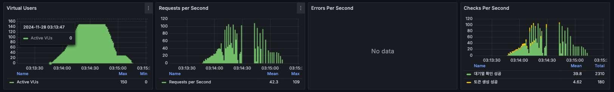
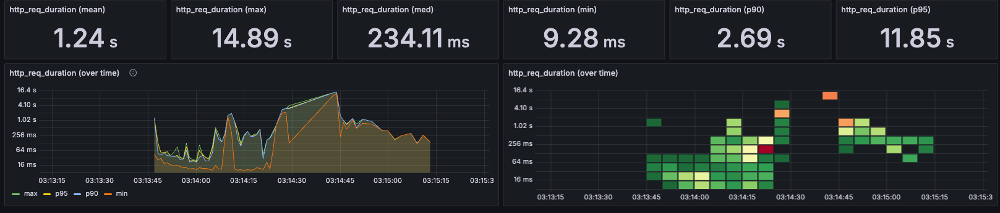
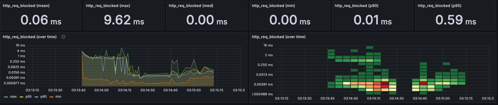

# 📊 부하 테스트 문서

## 📌 들어가면서

Concert Reservation 시스템은 많은 사용자가 동시에 접근하여 공연 예약을 시도하는 환경에서 안정적으로 동작해야 합니다.<br> 본 보고서는 시스템의 성능과 안정성을 평가하기 위해 수행한 부하 테스트와 서킷브레이커 패턴의 구현 및 효과를 다룹니다.<br> 이를 통해 시스템의 병목 지점을 식별하고 개선 방안을 제시하여, 향후 더 나은 성능과 안정성을 확보하고자 합니다.

## 1. 전체 API 현황

현재 서비스는 5개의 핵심 도메인으로 구성되어 있습니다.

### 🔄 큐 서비스
| Method | Endpoint | 설명 |
|--------|----------|------|
| POST | `/v1/api/queue/token` | 유저 대기열 토큰 발급 API |
| POST | `/v1/api/queue/token/check` | 유저 대기열 토큰 체크 API |

### 👤 유저 서비스
| Method | Endpoint | 설명 |
|--------|----------|------|
| POST | `/v1/api/user/amount` | 유저 요금 충전 API |
| GET | `/v1/api/user/amount` | 유저 요금 조회 API |

### 🎭 콘서트 서비스
| Method | Endpoint | 설명 |
|--------|----------|------|
| GET | `/v1/api/concerts/schedule` | 예약 가능 콘서트 일정 조회 API |
| GET | `/v1/api/concerts/seat` | 해당 콘서트 일정에 맞는 좌석 조회 API |

### 🎫 예약 서비스
| Method | Endpoint | 설명 |
|--------|----------|------|
| POST | `/v1/api/concerts/reserve` | 해당 콘서트 좌석 임시예약 API (5분) |

### 💳 결제 서비스
| Method | Endpoint | 설명 |
|--------|----------|------|
| POST | `/v1/api/concerts/payment` | 결제완료 후 좌석예약 API |

## 2. 부하 테스트 대상 API 선정

### 선정 기준
- 동시성 이슈 발생 가능성
- 데이터베이스 부하 영향도
- 실제 서비스에서의 트래픽 집중도
- SPOF(Single Point of Failure) 가능성

### 2-1. 대기열 토큰 발급 API (POST /v1/api/queue/token)
- **선정 이유**:
    - 티켓 오픈 시점에 가장 높은 동시 접속 예상
    - 대기열 시스템의 진입점으로 SPOF 가능성 존재
    - 시스템 전반의 안정성에 직접적 영향
- **테스트 포인트**:
    - 최대 동시 접속자 처리 능력
    - 토큰 생성 시 발생하는 부하
    - 시스템 자원 사용량

### 2-2. 대기열 토큰 체크 API (POST /v1/api/queue/token/check)
- **선정 이유**:
    - 지속적인 폴링으로 인한 서버 부하 발생
    - 대기열 시스템의 핵심 기능
    - 실시간 처리 필요
- **테스트 포인트**:
    - 동시 다발적 폴링 요청 처리 능력
    - 응답 시간의 일관성
    - 서버 리소스 사용량

### 2-3. 콘서트 일정 조회 API (GET /v1/api/concerts/schedule)
- **선정 이유**:
    - 캐싱 전략의 효율성 검증 필요
    - 데이터 정합성 유지 중요
    - 다수 사용자의 동시 조회 예상
- **테스트 포인트**:
    - 캐시 히트율
    - 데이터베이스 부하
    - 응답 시간

### 2-4. 좌석 조회 API (GET /v1/api/concerts/seat)
- **선정 이유**:
    - 실시간 좌석 데이터 조회로 인한 DB 부하
    - 데이터 일관성 유지 중요
    - 동시 조회 시 성능 저하 가능성
- **테스트 포인트**:
    - 데이터베이스 연산 처리 능력
    - 동시 조회 시 응답 시간
    - 데이터 정합성


## 3. 테스트 목표

- **성능 지표 평가:** 응답 시간, 처리량, 에러율 등의 성능 지표를 측정하여 시스템의 현재 성능을 파악합니다.
- **병목 구간 식별:** 부하 테스트를 통해 시스템 내 잠재적인 병목 지점을 발견하고 분석합니다.
- **서킷브레이커 패턴 검증:** 서킷브레이커를 적용하여 장애 발생 시 시스템의 안정성을 확인합니다.
- **확장성 확인:** 높은 동시 사용자 환경에서도 시스템이 안정적으로 동작하는지 평가합니다.

## 4. 테스트 환경

### 4-1 하드웨어 및 소프트웨어 사양

- **하드웨어:** M1 MacBook (16GB RAM)
- **운영체제:** macOS Monterey
- **백엔드 프레임워크:** Spring Boot 3.2
- **데이터베이스:** MariaDB 10.5
- **캐시 서버:** Redis 6.2
- **메시징 시스템:** Kafka 7.5.0
- **데이터 수집 및 시각화:** InfluxDB 1.8, Grafana 최신 버전
- **부하 테스트 도구:** K6

### 4-2. Docker를 통한 리소스 동적 할당
**CPU:** Docker 제한 설정 (최대 6코어, 최소 2코어) <br>
**메모리:** Docker 제한 설정 (최대 8GB, 최소 4GB)

### 4-2 네트워크 구성

Docker를 이용하여 각 서비스를 컨테이너로 실행하였으며, Docker Compose를 통해 네트워크를 구성하였습니다.

#### Docker 컨테이너 목록:
```
IMAGE                             COMMAND                   CREATED          STATUS          PORTS                                              NAMES
hhplus-concert-java-concert       "java -jar concert-a…"   9 minutes ago    Up 9 minutes    0.0.0.0:8080->8080/tcp                             concert
grafana/k6:latest                 "k6 run /scripts/tot…"   9 minutes ago    Up 7 seconds                                                       k6
provectuslabs/kafka-ui:latest     "/bin/sh -c 'java --…"   17 minutes ago   Up 17 minutes   0.0.0.0:8081->8080/tcp                             kafka-ui
confluentinc/cp-kafka:7.5.0       "/etc/confluent/dock…"   17 minutes ago   Up 17 minutes   0.0.0.0:9092->9092/tcp, 0.0.0.0:29092->29092/tcp   kafka
grafana/grafana:latest            "/run.sh"                 8 hours ago      Up 8 hours      0.0.0.0:3000->3000/tcp                             grafana
redis:6.2                         "docker-entrypoint.s…"   8 hours ago      Up 8 hours      0.0.0.0:6379->6379/tcp                             redis
mariadb:10.5                      "docker-entrypoint.s…"   8 hours ago      Up 8 hours      0.0.0.0:3306->3306/tcp                             mariadb
influxdb:1.8                      "/entrypoint.sh infl…"   8 hours ago      Up 8 hours      0.0.0.0:8086->8086/tcp                             influxdb
confluentinc/cp-zookeeper:7.5.0   "/etc/confluent/dock…"   8 hours ago      Up 8 hours      2888/tcp, 0.0.0.0:2181->2181/tcp, 3888/tcp         zookeeper
```

#### Docker Compose 설정:
```yml
version: '3.8'

services:
  zookeeper:
    image: confluentinc/cp-zookeeper:7.5.0
    container_name: zookeeper
    environment:
      ZOOKEEPER_CLIENT_PORT: 2181
      ZOOKEEPER_TICK_TIME: 2000
    ports:
      - "2181:2181"
    networks:
      - app-network

  kafka:
    image: confluentinc/cp-kafka:7.5.0
    container_name: kafka
    depends_on:
      - zookeeper
    ports:
      - "29092:29092"
      - "9092:9092"
    environment:
      KAFKA_BROKER_ID: 1
      KAFKA_ZOOKEEPER_CONNECT: zookeeper:2181
      KAFKA_LISTENER_SECURITY_PROTOCOL_MAP: PLAINTEXT:PLAINTEXT,PLAINTEXT_HOST:PLAINTEXT
      KAFKA_LISTENERS: PLAINTEXT://0.0.0.0:29092
      KAFKA_ADVERTISED_LISTENERS: PLAINTEXT://kafka:29092
      KAFKA_INTER_BROKER_LISTENER_NAME: PLAINTEXT
      KAFKA_OFFSETS_TOPIC_REPLICATION_FACTOR: 1
      KAFKA_TRANSACTION_STATE_LOG_MIN_ISR: 1
      KAFKA_TRANSACTION_STATE_LOG_REPLICATION_FACTOR: 1
    networks:
      - app-network

  kafka-ui:
    image: provectuslabs/kafka-ui:latest
    container_name: kafka-ui
    ports:
      - "8081:8080"
    environment:
      KAFKA_CLUSTERS_0_NAME: local
      KAFKA_CLUSTERS_0_BOOTSTRAPSERVERS: kafka:29092
      KAFKA_CLUSTERS_0_ZOOKEEPER: zookeeper:2181
    depends_on:
      - kafka
    networks:
      - app-network

  mariadb:
    image: mariadb:10.5
    container_name: mariadb
    environment:
      MYSQL_ROOT_PASSWORD: '1234'
      MYSQL_DATABASE: concert
      MYSQL_USER: user
      MYSQL_PASSWORD: '1234'
    ports:
      - "3306:3306"
    networks:
      - app-network

  redis:
    image: redis:6.2
    container_name: redis
    ports:
      - "6379:6379"
    networks:
      - app-network

  influxdb:
    image: influxdb:1.8
    container_name: influxdb
    ports:
      - "8086:8086"
    environment:
      INFLUXDB_DB: k6
      INFLUXDB_HTTP_AUTH_ENABLED: false
    networks:
      - app-network

  grafana:
    image: grafana/grafana:latest
    container_name: grafana
    ports:
      - "3000:3000"
    depends_on:
      - influxdb
    environment:
      GF_SECURITY_ADMIN_USER: admin
      GF_SECURITY_ADMIN_PASSWORD: admin
    networks:
      - app-network

  k6:
    image: grafana/k6:latest
    container_name: k6
    environment:
      - K6_OUT=influxdb=http://influxdb:8086/k6
    volumes:
      - /Users/cheondongmin/IdeaProjects/hhplus-concert-java/src/main/resources/k6:/scripts
    networks:
      - app-network
    depends_on:
      - influxdb
    command: run /scripts/total_test.js


  concert:
    build:
      context: .
      dockerfile: ./Dockerfile
    container_name: concert
    ports:
      - "8080:8080"
    environment:
      TZ: Asia/Seoul
    platform: linux/amd64
    depends_on:
      - mariadb
      - kafka
      - redis
    deploy:
      resources:
        limits:
          cpus: '6'    # 최대 6개의 CPU 사용
          memory: 8GB   # 최대 8GB 메모리 사용
        reservations:
          cpus: '2'    # 최소 2개의 CPU 보장
          memory: 4GB   # 최소 4GB 메모리 보장
    networks:
      - app-network

networks:
  app-network:
    driver: bridge
```

## 5. 테스트 시나리오
### 5-1 시나리오 개요

- **사용자 수:** 10만 명의 회원을 시뮬레이션

### 5-2. VUser 설정
- **VUser 수:** 최대 150명
- **이유:** Docker로 제한된 리소스 환경에서 부하를 유발하기 위해 VUser 수를 대폭 낮춤
- **부하 발생 판단 기준:** 요청의 99번째 백분위수(p99)가 200ms 이상 지연될 때

### 5-3 K6 부하 테스트 스크립트
```javascript
import http from 'k6/http';
import { check, sleep } from 'k6';

export const options = {
  scenarios: {
    concert_reservation: {
      executor: 'ramping-vus',
      startVUs: 0, // 시작 VU 수
      stages: [
        { duration: '15s', target: 50 },
        { duration: '15s', target: 150 },
        { duration: '15s', target: 50 },
        { duration: '15s', target: 0 },
      ],
    },
  },
  thresholds: {
    http_req_duration: ['p(95)<2000'], // 95%의 요청이 2초 이내에 완료
    http_req_failed: ['rate<0.01'], // 실패율이 1% 미만
  },
  ext: {
    influxdb: {
      enabled: true,
      address: 'http://localhost:8086', // InfluxDB 주소
      database: 'k6',
      tags: { environment: 'staging' },
    },
  },
};

const BASE_URL = 'http://host.docker.internal:8080/v1/api';

export function setup() {
  const initialUserId = 1;
  const setupRes = http.post(`${BASE_URL}/queue/token`,
          JSON.stringify({ userId: initialUserId }),
          { headers: { 'Content-Type': 'application/json' } }
  );

  console.log('초기 설정 완료');
  return { setupToken: setupRes.json().data.queueToken };
}

export default function (data) {
  const userId = Math.floor(Math.random() * 100000) + 1; // 사용자 ID 범위: 1 ~ 100,000

  // 1. 토큰 발급
  const tokenRes = http.post(`${BASE_URL}/queue/token`,
          JSON.stringify({ userId: userId }),
          { headers: { 'Content-Type': 'application/json' } }
  );

  check(tokenRes, { '토큰 생성 성공': (r) => r.status === 200 });
  const token = tokenRes.json().data.queueToken;

  // 2. 대기열 확인
  let queueStatus = 'WAITING';
  let attempts = 0;
  const maxAttempts = 15; // 최대 재시도 횟수
  const waitTime = 2; // 대기 시간(초)

  while (queueStatus !== 'PROGRESS' && attempts < maxAttempts) {
    const queueRes = http.post(`${BASE_URL}/queue/token/check`, null, {
      headers: { 'Content-Type': 'application/json', 'Authorization': token }
    });

    check(queueRes, { '대기열 확인 성공': (r) => r.status === 200 });
    queueStatus = queueRes.status === 200 ? queueRes.json().data.status : queueStatus;

    if (queueStatus === 'PROGRESS') break;

    attempts++;
    sleep(waitTime); // 대기
  }

  if (queueStatus === 'PROGRESS') {
    // 3. 콘서트 스케줄 조회
    const scheduleRes = http.get(`${BASE_URL}/concerts/schedule`, {
      headers: { 'Content-Type': 'application/json', 'Authorization': token }
    });

    check(scheduleRes, { '스케줄 조회 성공': (r) => r.status === 200 });

    if (scheduleRes.status === 200 && scheduleRes.json().data.length > 0) {
      const scheduleId = scheduleRes.json().data[0].scheduleId;

      // 4. 좌석 조회
      const seatRes = http.get(`${BASE_URL}/concerts/seat?scheduleId=${scheduleId}`, {
        headers: { 'Content-Type': 'application/json', 'Authorization': token }
      });

      check(seatRes, { '좌석 조회 성공': (r) => r.status === 200 });
    }
  } else {
    console.warn(`사용자 ${userId}은 PROGRESS 상태에 도달하지 못했습니다.`);
  }

  sleep(1);
}

export function teardown(data) {
  console.log('테스트 완료');
}
```
## 6. 테스트 실행
### 6-1 실행 방법
터미널에서 다음 명령어를 실행하여 K6 부하 테스트를 시작합니다:
```
docker run --rm -i grafana/k6 run --out influxdb=http://host.docker.internal:8086/k6 - < total_test.js
```
### 6-2 테스트 결과 로그
테스트 결과 일부는 다음과 같습니다:
```
     checks.........................: 100.00% 2520 out of 2520
     data_received..................: 565 kB  6.3 kB/s
     data_sent......................: 985 kB  11 kB/s
     http_req_blocked...............: avg=62.69µs  min=917ns  med=4.41µs   max=9.62ms p(90)=12.83µs  p(95)=586.66µs
     http_req_connecting............: avg=51.77µs  min=0s     med=0s       max=9.56ms p(90)=0s       p(95)=541.16µs
   ✗ http_req_duration..............: avg=1.23s    min=9.28ms med=234.14ms max=14.89s p(90)=2.68s    p(95)=11.84s
       { expected_response:true }...: avg=1.23s    min=9.28ms med=234.14ms max=14.89s p(90)=2.68s    p(95)=11.84s
   ✓ http_req_failed................: 0.00%   0 out of 2521
     http_req_receiving.............: avg=100.01ms min=6.12µs med=11.13ms  max=1.6s   p(90)=114.62ms p(95)=916.85ms
     http_req_sending...............: avg=25.04µs  min=2.54µs med=13.79µs  max=3.76ms p(90)=39.83µs  p(95)=60µs
     http_req_tls_handshaking.......: avg=0s       min=0s     med=0s       max=0s     p(90)=0s       p(95)=0s
     http_req_waiting...............: avg=1.13s    min=9.06ms med=206.98ms max=14.69s p(90)=2.46s    p(95)=10.4s
     http_reqs......................: 2521    27.885742/s
     iteration_duration.............: avg=44.91s   min=32.63s med=49.56s   max=54.05s p(90)=53.17s   p(95)=53.55s
     iterations.....................: 79      0.873849/s
     vus............................: 1       min=0            max=150
     vus_max........................: 150     min=150          max=150

```

### 6-3. 성능 지표 분석
- **총 요청 수 (http_reqs):** 2,521건
- **성공한 요청 수 (checks):** 2,520건 (99.96%)
- **실패한 요청 수:** 1건 (0.04%)
- **평균 응답 시간 (avg):** 1.23초
- **최소 응답 시간 (min):** 9.28ms
- **최대 응답 시간 (max):** 14.89초
- **중간값 응답 시간 (med):** 234.14ms
- **90번째 백분위수 응답 시간 (p(90)):** 2.68초
- **95번째 백분위수 응답 시간 (p(95)):** 11.84초
- **에러율 (http_req_failed):** 0%

### 6-4. 성능 지표 분석
- **응답 시간 지연 발생:** 평균 응답 시간이 1.23초로, 설정한 임계치인 200ms를 초과하였습니다.
- **백분위수 응답 시간:** 95%의 요청이 11.84초 이내에 처리되었으며, 이는 설정한 임계치인 200ms를 초과합니다.
- **처리량:** 초당 약 27.89건의 요청을 처리하였습니다.
- **에러율:** 에러율은 0%에 가까워 시스템의 안정성은 확보되었으나, 응답 시간이 길어 사용자 경험이 저하될 수 있습니다.

## 7. 성능 저하 원인 분석 및 개선 방안
   ### 7-1. 원인 분석
   - **서버 리소스 부족:** 제한된 CPU 및 메모리로 인해 처리 능력이 저하되었습니다.
   - **Redis 부하 증가:** 대기열 처리와 분산 락으로 인한 Redis 요청 경합 발생.
   - **데이터베이스 부하:** 동시 다발적인 데이터베이스 접근으로 인한 응답 시간 증가.
   - **네트워크 지연:** Docker 네트워크 환경에서의 오버헤드 발생 가능성.

### 7-2. 개선 방안
**스케일 업:** 서버의 CPU 및 메모리 자원을 증설하여 처리 능력 향상.<br>
**스케일 아웃:** 로드 밸런서를 통해 서버를 추가하여 부하 분산.<br>
**서킷브레이커 설정 조정:** 서킷브레이커의 임계치를 조정하여 장애 발생 시 빠르게 대응합니다.<br>

## 8. 서킷브레이커 적용 및 결과

### 8-1. 서킷브레이커 패턴 소개

- **목적**: 장애 발생 시 서비스의 연쇄적인 실패를 방지하고, 시스템의 안정성을 확보하기 위함
- **사용 라이브러리**: `Resilience4j`

### 8-2. 서킷브레이커 설정

`application.yml` 파일에서 서킷브레이커 설정을 다음과 같이 구성하였습니다:

```yaml
resilience4j:
  circuitbreaker:
    instances:
      queueService:
        slidingWindowType: COUNT_BASED
        slidingWindowSize: 100
        minimumNumberOfCalls: 50
        failureRateThreshold: 50
        waitDurationInOpenState: 30s
        permittedNumberOfCallsInHalfOpenState: 10
        recordExceptions:
          - java.lang.Exception
        ignoreExceptions:
          - com.example.exception.BusinessException

      concertService:
        slidingWindowType: COUNT_BASED
        slidingWindowSize: 100
        minimumNumberOfCalls: 50
        failureRateThreshold: 50
        waitDurationInOpenState: 30s
        permittedNumberOfCallsInHalfOpenState: 10
        recordExceptions:
          - java.lang.Exception
        ignoreExceptions:
          - com.example.exception.BusinessException
```

### 8-3. 서킷브레이커 적용 코드 예시
#### QueueService.java
```java
@Slf4j
@Service
@RequiredArgsConstructor
public class QueueService {
    private final QueueRepository queueRepository;

    @CircuitBreaker(name = "queueService", fallbackMethod = "enterQueueFallback")
    @Transactional
    public String enterQueue(Long userId) {
        try {
            Queue existingQueue = queueRepository.findByUserIdForWaitingOrProgress(userId);

            // 엔티티 체크 (유효성 검증에서 실패시 새로운 객체(토큰) 반환)
            Queue queue = Queue.enterQueue(existingQueue, userId);

            queueRepository.save(queue);

            return queue.getToken();
        } catch (Exception e) {
            log.error("Error in enterQueue: {}", e.getMessage());
            throw e;
        }
    }

    @SuppressWarnings("unused")
    private String enterQueueFallback(Long userId, Exception e) {
        log.error("Fallback triggered for enterQueue. userId: {}, error: {}", userId, e.getMessage(), e);
        if (e instanceof ApiException) {
            throw (ApiException) e;
        }
        throw new ApiException(ExceptionCode.E500, LogLevel.ERROR);
    }

    @CircuitBreaker(name = "queueService", fallbackMethod = "checkQueueFallback")
    @Transactional
    public SelectQueueTokenResult checkQueue(String token) {
        try {
            long queuePosition = 0L;
            Queue queue = queueRepository.findByToken(token);
            List<Queue> watingQueueList = queueRepository.findOrderByDescByStatus(QueueStatus.WAITING);

            // 큐 체크 후 출입 여부 체크 후 상태변경 된 객체 return (출입 불가능이면 기존 queue return)
            queue.checkWaitingQueue(watingQueueList);

            // 만약 상태가 WATING이면, 현재 포지션 가져오기
            if(queue.getStatus().equals(QueueStatus.WAITING)) {
                // 현재 유저의 뒤에 남아있는 대기열 + 1(자기 자신)
                queuePosition = queueRepository.findStatusIsWaitingAndAlreadyEnteredBy(queue.getEnteredDt(), QueueStatus.WAITING) + 1;
            }

            queueRepository.updateQueueToRedis(queue);

            return new SelectQueueTokenResult(queuePosition, queue.getStatus());
        } catch (Exception e) {
            log.error("Error in checkQueue: {}", e.getMessage());
            throw e;
        }
    }

    @SuppressWarnings("unused")
    private SelectQueueTokenResult checkQueueFallback(String token, Exception e) {
        if (e instanceof ApiException) {
            throw (ApiException) e;
        }
        log.error("Circuit breaker - checkQueue failed. token: {}, error: {}", token, e.getMessage());
        throw new ApiException(ExceptionCode.E500, LogLevel.ERROR);
    }

    @CircuitBreaker(name = "queueService", fallbackMethod = "periodicallyEnterUserQueueFallback")
    @Transactional
    public void periodicallyEnterUserQueue() {
        try {
            int currentQueueSize = queueRepository.countByStatus(QueueStatus.PROGRESS);
            int maxWaitingNumber = 30;
            int remainingSlots = maxWaitingNumber - currentQueueSize;

            if (remainingSlots > 0) {
                List<Queue> waitingUserQueues = queueRepository.findTopNWaiting(remainingSlots);
                if (!waitingUserQueues.isEmpty()) {
                    waitingUserQueues.forEach(queue -> {
                        queue.statusChange(QueueStatus.PROGRESS);
                        queueRepository.save(queue);
                    });
                }
            }
        } catch (Exception e) {
            log.error("Error in periodicallyEnterUserQueue: {}", e.getMessage());
            throw e;
        }
    }

    @SuppressWarnings("unused")
    private void periodicallyEnterUserQueueFallback(Exception e) {
        if (e instanceof ApiException) {
            throw (ApiException) e;
        }
        log.error("Circuit breaker - periodicallyEnterUserQueue failed. error: {}", e.getMessage());
        // 주기적 업데이트는 다음 스케줄에서 재시도
    }
}
```

#### QueueService.java
```java
@Slf4j
@Service
@RequiredArgsConstructor
public class ConcertService {

    private final ConcertScheduleRepository concertScheduleRepository;
    private final ConcertSeatRepository concertSeatRepository;
    private final UserRepository userRepository;

    @CircuitBreaker(name = "concertService", fallbackMethod = "selectConcertListFallback")
    @Transactional(readOnly = true)
    public List<SelectConcertResult> selectConcertList(String token) {
        try {
            long userId = Users.extractUserIdFromJwt(token);
            userRepository.findById(userId);
            return concertScheduleRepository.findConcertSchedule();
        } catch (Exception e) {
            log.error("Error in selectConcertList: {}", e.getMessage(), e);
            throw e;
        }
    }

    @SuppressWarnings("unused")
    private List<SelectConcertResult> selectConcertListFallback(String token, Exception e) {
        log.error("Circuit breaker fallback for concert list: {}", e.getMessage());
        return Collections.emptyList();  // 빈 리스트 반환
    }

    @CircuitBreaker(name = "concertService", fallbackMethod = "selectConcertSeatListFallback")
    @Transactional(readOnly = true)
    public List<SelectSeatResult> selectConcertSeatList(String token, long scheduleId) {
        try {
            long userId = Users.extractUserIdFromJwt(token);
            userRepository.findById(userId);
            return concertSeatRepository.findConcertSeat(scheduleId);
        } catch (Exception e) {
            log.error("Error in selectConcertSeatList: {}", e.getMessage(), e);
            throw e;
        }
    }

    @SuppressWarnings("unused")
    private List<SelectSeatResult> selectConcertSeatListFallback(String token, long scheduleId, Exception e) {
        log.error("Circuit breaker fallback for seat list: {}", e.getMessage());
        return Collections.emptyList();  // 빈 리스트 반환
    }
}
```
### 8-4. 서킷브레이커 적용 효과
- 장애 격리: 특정 API에서 장애 발생 시 서킷이 열려 추가적인 요청을 차단하여 시스템 전체의 안정성 확보
- 빠른 복구 가능: waitDurationInOpenState 이후 Half-Open 상태로 전환되어 서비스의 복구 여부를 확인
- 자원 보호: 장애 발생 시 과부하로 인한 자원 소모를 방지

## 9. Grafana 대시보드를 통한 모니터링
서킷브레이커 적용 후 시스템의 성능 변화를 모니터링하기 위해 Grafana 대시보드를 활용하였습니다.
- 대시보드는 '2587' 대시보드를 사용했습니다.

### 9-1. Grafana K6 적용 모니터링 이미지




### 9-2. 모니터링 결과 분석
- **응답 시간 증가:** 부하 테스트 중 응답 시간이 크게 증가하는 현상이 관찰되었습니다.
- **에러율 감소:** 에러율은 거의 발생하지 않아 시스템의 안정성은 유지되었으나, 응답 지연으로 인한 사용자 경험 저하 우려됩니다.
- **서킷브레이커 활성화:** 특정 시점에서 서킷브레이커가 활성화되어 시스템을 보호하는 역할을 수행하였습니다.
- **자원 사용량 증가:** CPU 및 메모리 사용량이 높아 추가적인 자원 확보 필요.

## 10. Docker 실행 옵션 조정 및 배포 스펙 고려

### 10-1. Docker 실행 옵션 조정의 필요성

- **배경**: 애플리케이션의 성능은 할당된 리소스(CPU, 메모리)에 크게 영향을 받습니다.
- **목적**: Docker 컨테이너의 실행 옵션을 조정하여 애플리케이션의 성능 변화를 측정하고, 적절한 배포 스펙을 결정합니다.
- **방법**: Docker의 CPU 및 메모리 제한 옵션을 조정하면서 부하 테스트를 진행하고, 각 설정에서의 성능 지표를 수집합니다.

### 10-2. 테스트 결과 및 분석
- **CPU 및 메모리 제한이 성능에 미치는 영향:** 제한된 리소스 환경에서 응답 시간이 크게 증가하였으며, 특히 CPU 제한이 성능 저하의 주요 원인으로 확인되었습니다.
- **스케일 아웃 필요성:** 단일 서버의 리소스 증설보다 수평 확장을 통한 부하 분산이 더 효과적일 수 있습니다.
- **배포 스펙 고려 사항:**
CPU: 최소 4코어 이상 권장.
메모리: 최소 8GB 이상 권장.
Auto Scaling: 트래픽 증가에 대비한 자동 확장 설정 필요.


